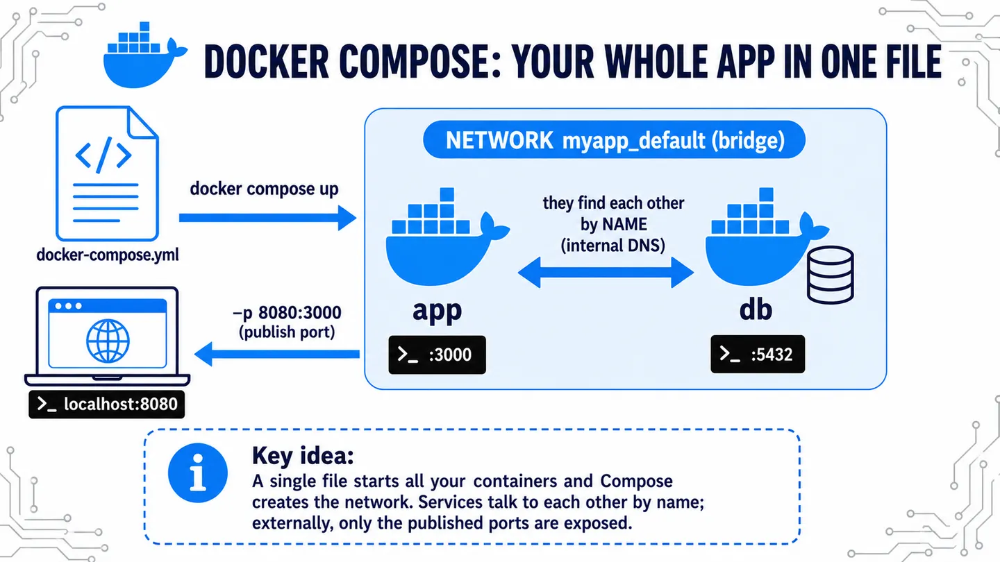

Docker Compose lets you define **your whole application —several containers— in a single YAML file** and bring it up with one command. Instead of running each `docker run` by hand and remembering the networks, ports and order, you declare it once in `docker-compose.yml`.



⚠️ Compose **automatically** creates a project-specific bridge network (`<project>_default`) and connects every service to it. That's why **they find each other by service name** (DNS) — exactly the network you had to set up by hand in the networking pill.

## Example

An app and its database, each in its own container:

```yaml
# docker-compose.yml
services:
  app:
    image: my-app:1.0
    ports:
      - "8080:3000"
    environment:
      DATABASE_URL: postgres://db:5432/mydb   # 'db' = service name
    depends_on:
      - db

  db:
    image: postgres:16
    environment:
      POSTGRES_PASSWORD: secret
```

The app connects to the database by writing `db` as if it were its address. It doesn't need to know its IP: Compose put both containers on the same network, and there `db` resolves on its own. Before, you ran two `docker run` commands and created the network by hand; now it's one file and a single `docker compose up`.

## Basic commands

```bash
docker compose up -d      # build and start everything in the background
docker compose ps         # see the services and their status
docker compose logs -f    # follow the logs of all services
docker compose down       # stop and remove containers and network
```
