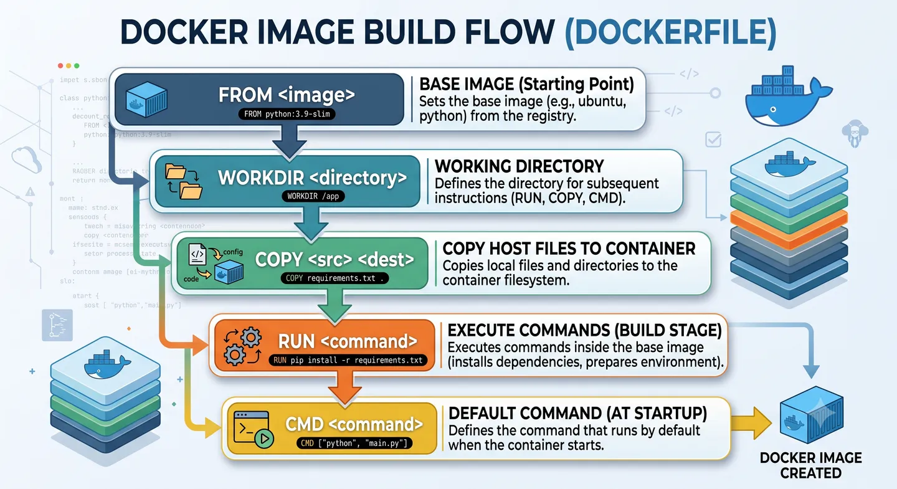
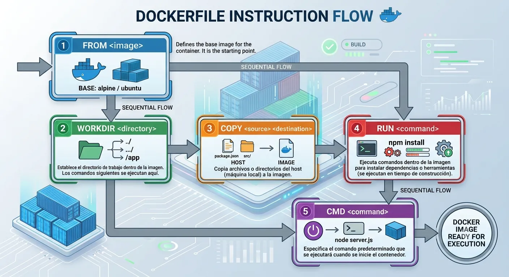
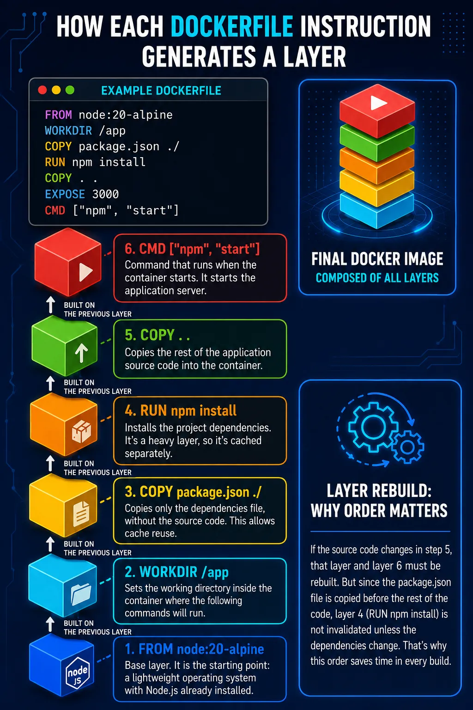

A Dockerfile is a plain-text file where we define the instructions Docker must run to build an image.

We can think of it as our application's recipe: which base image we use, which files we copy, which dependencies we install and which command runs when the container starts.

## What problem it solves

It solves the need to build environments declaratively and reproducibly.

Instead of configuring servers by hand, we write down how our application's image should be prepared. This reduces errors, makes deployments easier and lets anyone on the team build the same environment.

## How it works under the hood

When you run `docker build`, Docker reads the Dockerfile instruction by instruction and generates layers inside the image.

Each instruction (`FROM`, `RUN`, `COPY`, etc.) creates a new layer. These layers stack up to form the final image, and Docker can reuse them from cache if they haven't changed.

This matters for two reasons:

1. **Build cache:** if a layer didn't change from the previous build, Docker reuses it. That's why order matters: put what changes least first, like dependencies, and the source code afterwards.
2. **Immutability:** once created, a layer is never modified. If something changes, Docker creates a new layer on top.

The main instructions you'll use almost every time:

| Instruction | What it does |
|---|---|
| `FROM` | Sets the base image to start from |
| `WORKDIR` | Sets the working directory inside the container |
| `COPY` / `ADD` | Copies files from the host into the image |
| `RUN` | Runs a command during the build (install dependencies, compile, etc.) |
| `ENV` | Defines environment variables available in the container |
| `EXPOSE` | Documents which port the application uses (doesn't publish it, just informs) |
| `USER` | Sets which user the process runs as |
| `CMD` / `ENTRYPOINT` | Defines the command that runs when the container starts |
| `ARG` | Defines variables available only during the build |
| `HEALTHCHECK` | Defines how to check whether the container is "healthy" |

There are more instructions (`VOLUME`, `LABEL`, `SHELL`, `ONBUILD`, `STOPSIGNAL`, etc.), but they're used more occasionally. You can check the full list in the [official Dockerfile documentation](https://docs.docker.com/reference/dockerfile/).



### COPY vs ADD

In the basic case they do the same thing: copy files from the host into the image.

The difference is that `ADD` can automatically extract `.tar` archives and copy from a remote URL. Since it has more implicit behaviour, the common practice is to use `COPY` and reserve `ADD` for specific cases.

### CMD vs ENTRYPOINT

They aren't two ways of doing the same thing; they can be combined.

- `ENTRYPOINT` defines the container's main executable.
- `CMD` defines the default arguments, and can be overridden when running `docker run`.

```dockerfile
ENTRYPOINT ["node"]
CMD ["index.js"]
```
```bash
docker run my-app              # runs: node index.js
docker run my-app other.js     # runs: node other.js (only the argument changes)
```

Rule of thumb: if the container only runs one application, `CMD` is usually enough. If it works more like a tool with different arguments, `ENTRYPOINT` + `CMD` may make more sense.


