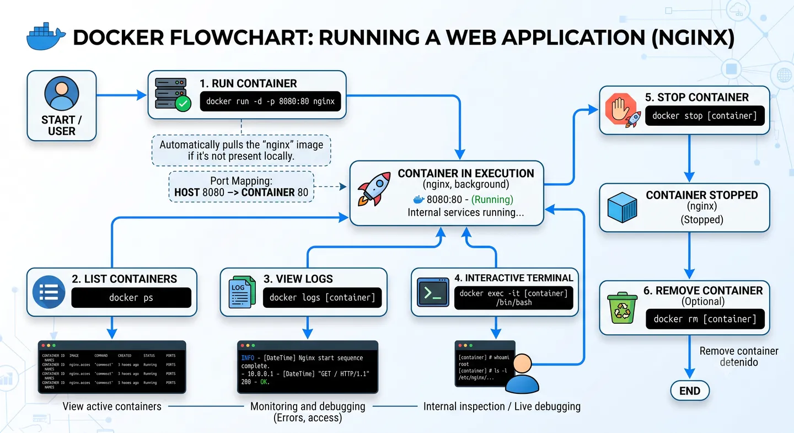
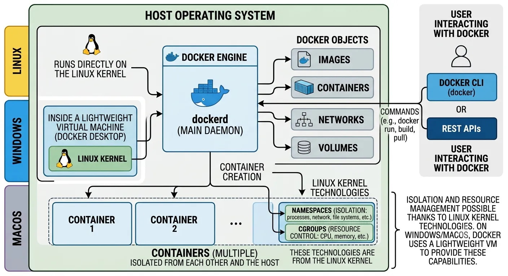

Docker is an open platform for developing, shipping and running applications.

It lets you package an application together with everything it needs to run: dependencies, configuration and runtime environment. This way, the same software runs consistently across local, testing or production.

## What problem it solves

It exists to solve one of the most common problems in development: "it works on my machine".

Docker helps an application run the same way across different environments, reducing configuration issues, incompatible dependencies or differences between operating systems.

It also makes deployment easier, since we can build an image once and run it as many times as we need.

## How it works under the hood

Docker relies on Linux kernel technologies, such as `namespaces` and `cgroups`, to create isolated environments called containers.

When you run a container, Docker isolates its processes, network and filesystem. This lets each container run independently within the same host, without interfering with other containers or with the host machine.

Docker Engine is the main component. It works with a client-server architecture:

- **Docker daemon (`dockerd`)**: manages images, containers, networks and volumes.
- **Docker CLI (`docker`)**: lets you interact with the daemon through commands.

