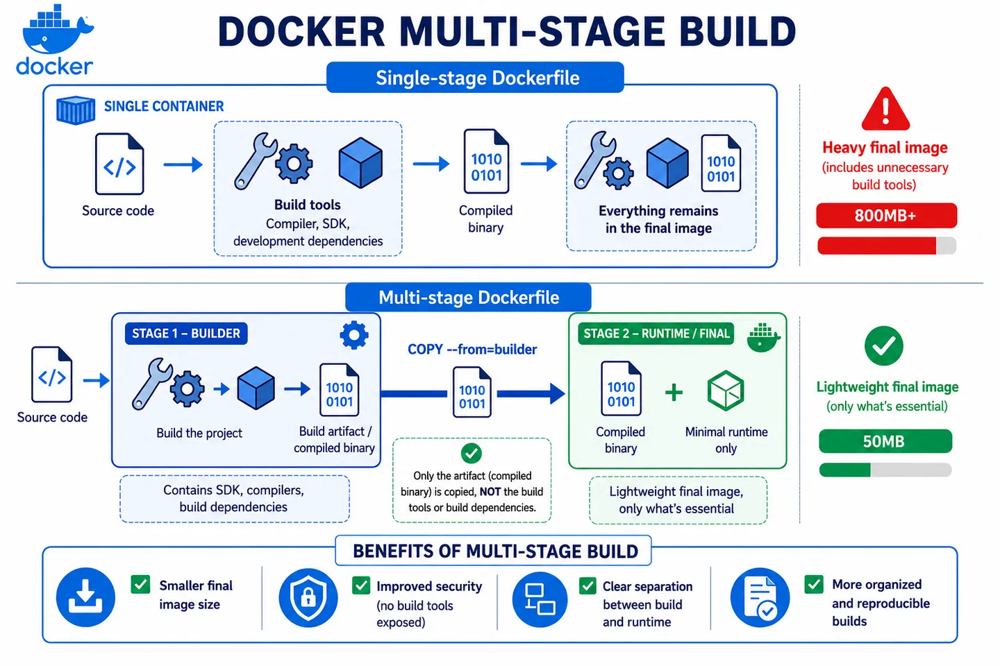

Multi-stage build is a Docker feature that lets you use several `FROM` instructions within a single Dockerfile.

Each `FROM` creates an independent stage. Typically we use one stage to build the application and another to produce the final image that will run in production.



## What problem it solves

It exists to reduce the final size of Docker images.

Without multi-stage, the final image usually drags along everything used during the build: compilers, development dependencies, caches, untranspiled source code, etc.

This increases the image size, slows down deployments and also increases the attack surface, since we're including tools we don't need in production.

Multi-stage separates two moments:

- **Build:** everything needed to compile or prepare the application.
- **Runtime:** only what's needed to run it.

## How it works under the hood

Each `FROM` in the Dockerfile creates an isolated stage, with its own filesystem.

Stages don't share anything automatically. If we want to pass something from one stage to another, we have to copy it explicitly with `COPY --from=<stage>`.

We can name a stage with `AS name` to reference it later:

```dockerfile
FROM node:20 AS builder
```

The final image will be the last stage in the Dockerfile. The previous ones are used during the build, but aren't part of the final result unless we copy files from them.

## Example

**Without multi-stage:** the final image drags along everything used during the build.

```dockerfile
FROM node:20
WORKDIR /app
COPY package*.json ./
RUN npm ci
COPY . .
RUN npm run build
CMD ["node", "dist/index.js"]
```

**With multi-stage:** the final image only contains what's needed to run the application.

```dockerfile
FROM node:20 AS builder
WORKDIR /app
COPY package*.json ./
RUN npm ci
COPY . .
RUN npm run build

FROM node:20-alpine
WORKDIR /app
COPY --from=builder /app/dist ./dist
COPY --from=builder /app/node_modules ./node_modules
USER node
CMD ["node", "dist/index.js"]
```
