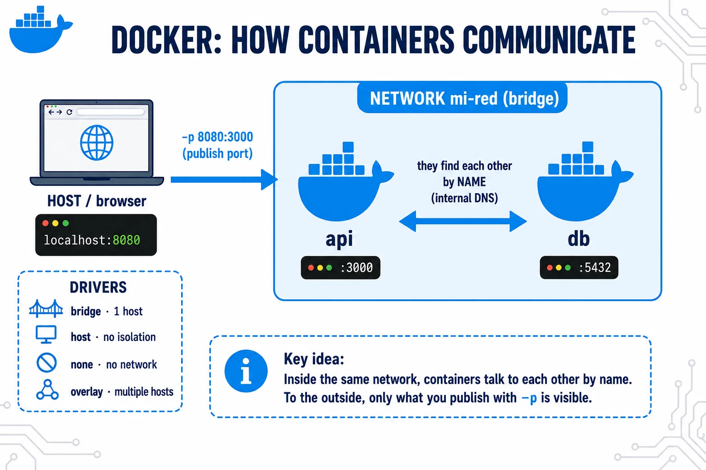

A Docker network is the system that lets containers **communicate with each other and with the outside world**. Docker creates isolated virtual networks and connects containers to them, controlling what can talk to what.



⚠️ The **default** `bridge` network (the one that exists without creating anything) does NOT have internal DNS between containers — only bridge networks created explicitly with `docker network create` do. It's the most common trap: two containers on the default network don't resolve each other by name.

## Example

In practice you almost always use a `bridge` network you create yourself — which is exactly what Docker Compose sets up under the hood without you noticing.

```bash
docker network create my-net

docker run -d --name db  --network my-net postgres:16
docker run -d --name app --network my-net -p 8080:3000 my-app:1.0   # your image
```

All containers on `my-net` see each other by name (DNS): inside `app` you connect to the database with `db:5432`, without knowing its IP. Only what you publish with `-p` is exposed to the outside.

> Other drivers exist for specific cases — `host` (shares the host's network, no isolation), `none` (no network) and `overlay` (multiple machines, the basis of Docker Swarm) — but day to day, and especially with Compose, you work with `bridge`.

## Inspect and clean up

```bash
docker network ls              # list networks
docker network inspect my-net  # see which containers are connected
docker network rm my-net       # remove it (must have no containers)
```
