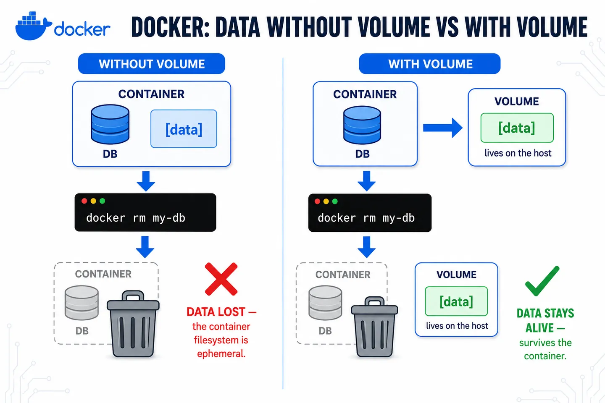
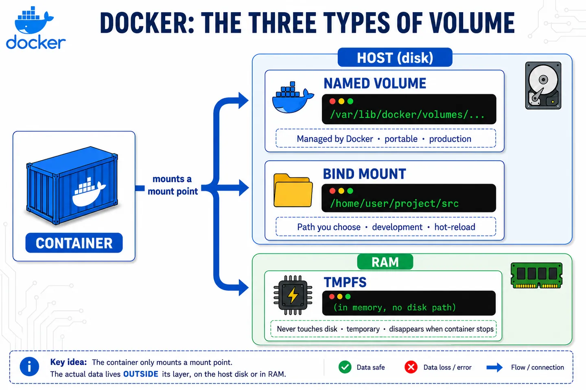

A volume is Docker's mechanism for persisting data outside the container's lifecycle.

It's storage that lives on the host and is mounted inside the container. It keeps existing even if you stop or remove the container.

## What problem it solves

By default, a container's filesystem is ephemeral: everything written inside lives in its writable layer and is lost when you run `docker rm`.

Volumes separate the data from the container that uses it. That way the information survives restarts, image updates or container re-creation, and can be shared across several containers at once.



## How it works under the hood

Docker mounts the volume as a point inside the container's filesystem, but the actual data lives outside its layer, with a lifecycle of its own: it only disappears if you delete it explicitly.

There are three types:

- **Named volume**: managed by Docker. The portable option, meant for production.
- **Bind mount**: a host path you choose yourself. Typical in development for code hot-reload.
- **tmpfs**: lives in RAM only and never touches disk. For temporary data you want fast or that shouldn't leave a trace.

⚠️ If you mount a volume over a path that already had content in the image, that content is overwritten.



## Example

**Named volume:**
```bash
docker volume create db_data
docker run -d --name my-db -v db_data:/var/lib/postgresql/data postgres:16
```
If you remove and recreate `my-db` pointing at the same volume, the data is still there.

**Bind mount:**
```bash
docker run -d -v $(pwd)/src:/app/src my-app:dev
```
Any change in `./src` is reflected instantly inside the container.

**tmpfs:**
```bash
docker run -d --tmpfs /app/cache my-app:dev
```
Whatever is written to `/app/cache` lives in RAM only and disappears when the container stops. It's the least common type: in practice you mostly see it in production/k8s (where it maps to an in-memory `emptyDir`) for fast temporary caching or data that shouldn't touch disk. Careful: it consumes host RAM, so don't use it for large amounts of data.

**Inspect and clean up:**
```bash
docker volume ls              # list volumes
docker volume inspect db_data # see where it physically lives
docker volume rm db_data      # remove it (the data is lost!)
```
