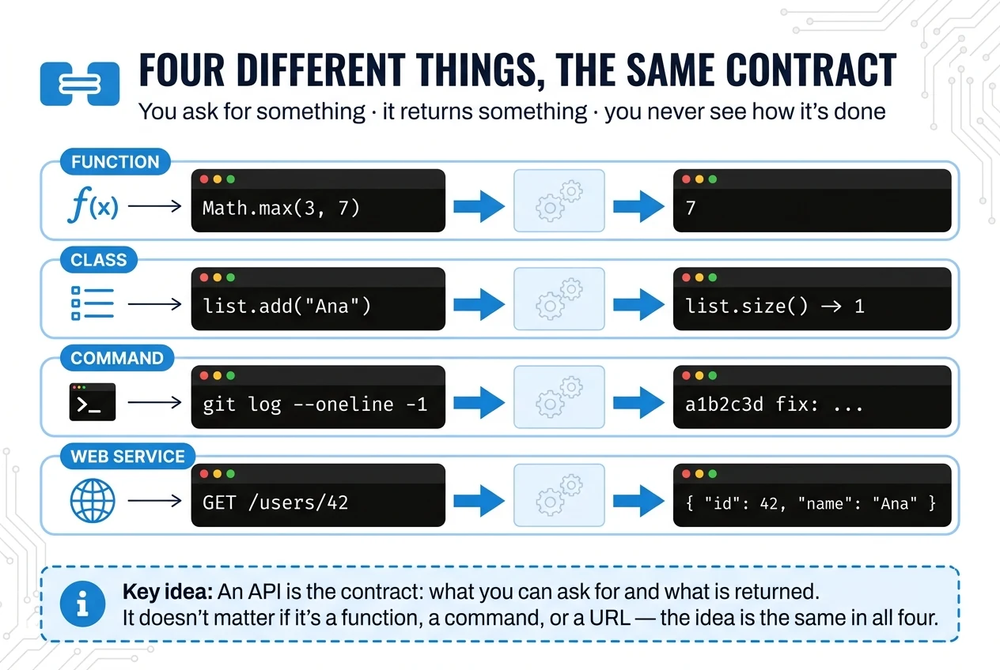

An API (*Application Programming Interface*) is **the contract by which a piece of software lets others ask it for things**: what you can ask for, how to ask for it and what you get back.

## What it is for

To use something without knowing how it is built.

When you write `Math.max(3, 7)` you have no idea which algorithm compares the numbers, and you do not need to: you know you pass it two and it returns the bigger one. That agreement is the API.

As long as it is honoured, whoever is on the other side can rewrite everything inside without breaking anything for you.



## All of these are APIs

**A function.** You pass arguments, you get something back:

```js
Math.max(3, 7)   // 7
```

**The public methods of a class.** What you can call from the outside:

```java
List<String> list = new ArrayList<>();
list.add("Ana");
list.size();   // 1
```

Inside, `ArrayList` keeps an array that grows and gets copied when it fills up. You never touch it.

**A command.** You give it arguments, it gives you an output:

```bash
git log --oneline -1
```

**A web service.** You send a request, you get a response:

```http
GET /users/42

{ "id": 42, "name": "Ana" }
```

Four technologies with nothing in common and the same idea in all four: someone publishes what you can ask for, and you ask for it without looking inside.

⚠️ Changing an API is not changing code: it is breaking the contract of everyone who depended on it. That is why APIs are versioned.
