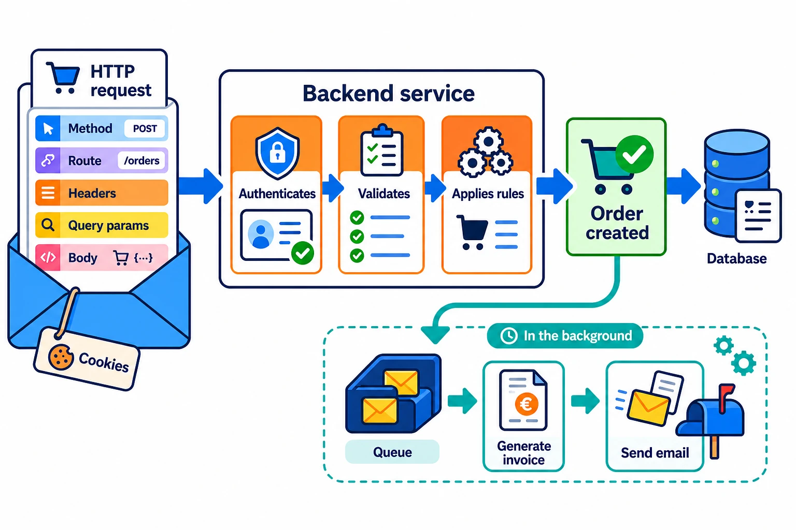

A backend is **a service that receives messages, performs work, and returns a
result**. It usually runs on one or more servers, but it is not the server
itself: the server is the machine or process that can receive traffic; the
backend is the code that decides what to do with that traffic.

Most often it receives HTTP requests. A website, mobile app, or integration
sends a message and the service responds. It can also receive queue messages or
start on a schedule, but the idea is the same: a signal arrives and the backend
applies the system's rules.

## What arrives in an HTTP request

Imagine someone confirms an order. The frontend might send something like this:

```http
POST /orders?coupon=SUMMER
Authorization: Bearer <token>
Cookie: session=...
Content-Type: application/json

{ "products": ["keyboard"], "address": "..." }
```

The request has a **path** (`/orders`) and a **method** (`POST`) that express
the operation. Headers carry metadata, such as the content format or identity.
Query parameters (`coupon=SUMMER`) refine the request. The body carries the
data to create or modify. Cookies also travel in headers; a browser attaches
them, for example, to identify a session.



## From message to operation

A backend does not run a request exactly as it arrives. First it decides which
code handles that path. It can then authenticate the person, check that they
are allowed to buy, validate that the fields make sense, and apply business
rules: stock must exist, the price must be current, and the coupon must still
be valid.

Only then does it change data: it reduces stock and saves the order. Finally it
returns an HTTP response. That may be `201 Created` with the order, `400` for
missing data, `401` when no valid identity is provided, or `409` when stock has
run out. The frontend uses that response to update the screen, but it does not
decide whether the operation was valid.

This centralisation lets the website, mobile app, and an external integration
use the same rules without copying them into every client.

## CRUD is only part of the work

Many APIs expose CRUD operations: create, read, update, and delete data. In a
shop, `POST /orders` creates an order, `GET /orders/42` reads it, `PATCH
/orders/42` changes an allowed value, and `DELETE /cart/items/7` removes a
product from the cart.

CRUD describes the data change; it does not replace the rules. Creating an
order is not simply inserting a row: identity, stock, prices, and the effects
of the purchase still have to be checked.

## It can keep working after the response

Not everything needs to finish before the backend responds. After creating an
order, it can put a job in a **queue** and respond straight away. Another
process consumes that job later: it generates the invoice and sends the email.

The person does not wait for a PDF to render or an email provider to respond.
If sending fails, the worker can retry it without repeating the purchase.
Scheduled tasks and messages from other services are handled in a similar way.

⚠️ Hiding a button in the frontend improves the experience, but it does not
protect the operation. Anyone can build an HTTP request themselves, which is
why authentication, permissions, and important rules belong in the backend.
