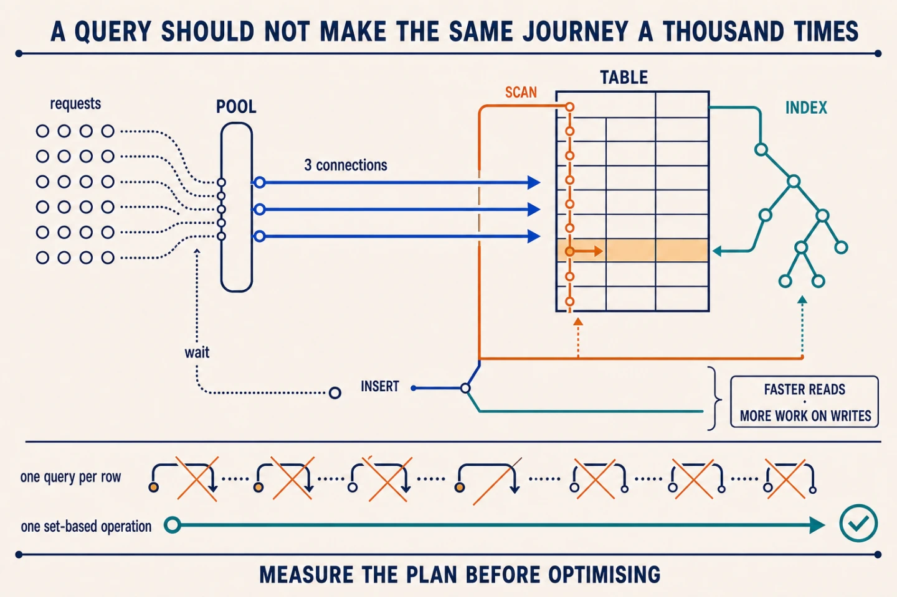

A database is **a system for storing information, finding it, and keeping it
consistent while several operations use it at once**. In an online shop, it is
where products, stock, and orders live, even when the backend restarts.

## How it stores information

In a relational database, information is organised into tables made of rows and
columns. Underneath, the engine groups those rows into pages that it can read
from disk and keep in memory when they are used frequently.

The application does not touch those files directly. It sends a query and the
engine decides which pages to read, how to relate the data, and which changes to
write without leaving the information half-updated.

## Connections have a limit too

Opening a new connection for every query costs time and resources. A backend
therefore usually keeps a *pool*: a small group of open connections that it
lends to each operation and takes back when the operation finishes.

If they are all busy, later requests wait. Increasing the pool without a limit
does not create free capacity; it only lets more work reach the database at the
same time. If the queries are slow, that can make the problem worse.

## An index avoids searching row by row

Without an index, finding one customer's orders may require checking the entire
table. An index keeps selected values in an ordered structure and points to the
rows where they live. The engine can discard whole blocks of data instead of
checking them one by one.

That is why indexes work well for columns used frequently in filters, sorting,
or joins. It is also why creating one for every column is a bad idea.

Every `INSERT`, `UPDATE`, or `DELETE` must update the table and every affected
index. Reads become faster; writes pay in extra work and storage.

## A query can repeat work without making it obvious

A correlated subquery runs using data from each row of the outer query.
Sometimes that expresses exactly what you need. Other times it repeats the same
access thousands of times when a `JOIN`, an earlier aggregation, or a batch
query could solve it in one pass.

⚠️ Optimisation is not a collection of tricks. Start with the execution plan:
how many rows the query reads, which indexes it uses, and where it spends its
time. Without that information, adding an index or rewriting SQL is a guess.
