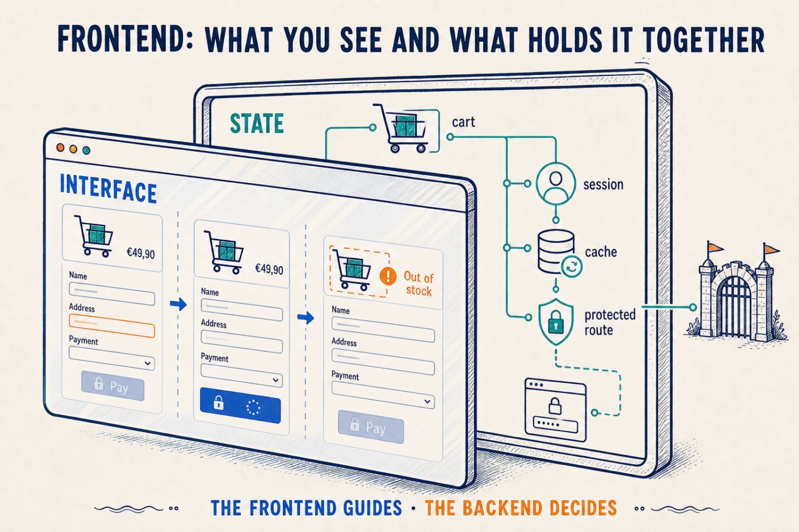

A web frontend is **the HTML, CSS, and JavaScript that a server delivers to the
browser to build an interface**.

HTML defines the structure, CSS decides how it looks, and JavaScript lets it
change and respond to each action. However much React, Vue, or Angular you use,
those are the three things the browser understands in the end.

## Before it reaches the browser

When you run `npm run dev`, you usually start a development server. Tools such
as Vite transform the code and update the browser as soon as you save a file.
It is built to make development comfortable, not to receive real traffic.

To publish the application, you run a *build*. The bundler walks through the
code, removes what is not used, splits the result, and generates something like
this:

```text
dist/
├── index.html
├── assets/app-a91f2.js
├── assets/styles-77c3a.css
└── assets/logo-2d10f.webp
```

Those files can be served by Nginx, a bucket, or a CDN. Hashed names let them
remain cached for a long time: when the content changes, the URL changes too and
the browser downloads the new version.

There are exceptions. A frontend using server-side rendering —SSR— may need a
production process that builds the HTML for each request. Even then, the browser
ultimately receives HTML, CSS, and JavaScript.

## Inside the browser

The browser turns HTML into an object tree called the **DOM**. JavaScript can
add nodes, change text, or remove elements, and the browser paints whatever
needs updating.

To decide what to paint, the application needs to know what is happening. If a
cart appears in the header and at checkout, both places must show the same
products. That information is **state**.

If only one component uses a value, it can live there. If its children need it
too, it can travel through props. *Prop drilling* appears when it crosses several
components that do not use it just to reach another one; Context, Redux, and
Zustand let it be shared without passing through the entire chain.

The point is not to store everything globally. The closer data lives to where it
is consumed, the fewer parts of the application can change it or depend on it
without a reason.

React connects that state to the screen through an in-memory representation
called the *virtual DOM*. When state changes, it compares the previous result
with the new one and applies the necessary changes to the real DOM. It is not
another kind of HTML or something the browser understands; it is React's
strategy for deciding what to touch.

Routes answer a similar question: which interface belongs to each URL. React
Router can decide in the browser; Astro can generate the HTML during the build;
Next.js can render it on the server as well.



## When it talks to the backend

Imagine you are confirming an order. The frontend already knows whether the
address is missing, so it can keep the button disabled. When you press it, it
can lock the button while it waits instead of sending the operation twice. And
if the backend says a product has gone out of stock, it can show which one and
what you can do next.

This is where the visual and technical sides meet. The screen must represent
whether the request is loading, completed, or failed; the backend must return
errors the frontend can turn into useful messages.

Data from the API is **remote state**. The product list on screen is a copy and
can become stale. A request cache can reuse it for a period —a five-minute TTL,
for example— and avoid more network calls. It also needs to know when to
invalidate it: after creating an order, stock may need fetching even if the TTL
has not ended.

The session follows the same journey. The frontend can use it to protect a route
and send you to login before showing a private screen. That improves the
experience, not security: anyone can alter the browser or call the API directly,
so the backend checks the permissions again.

⚠️ A frontend is not just “the pretty part”, but it is not a second backend
either. It is the code that reaches the browser and keeps the interface coherent
while someone uses it.
