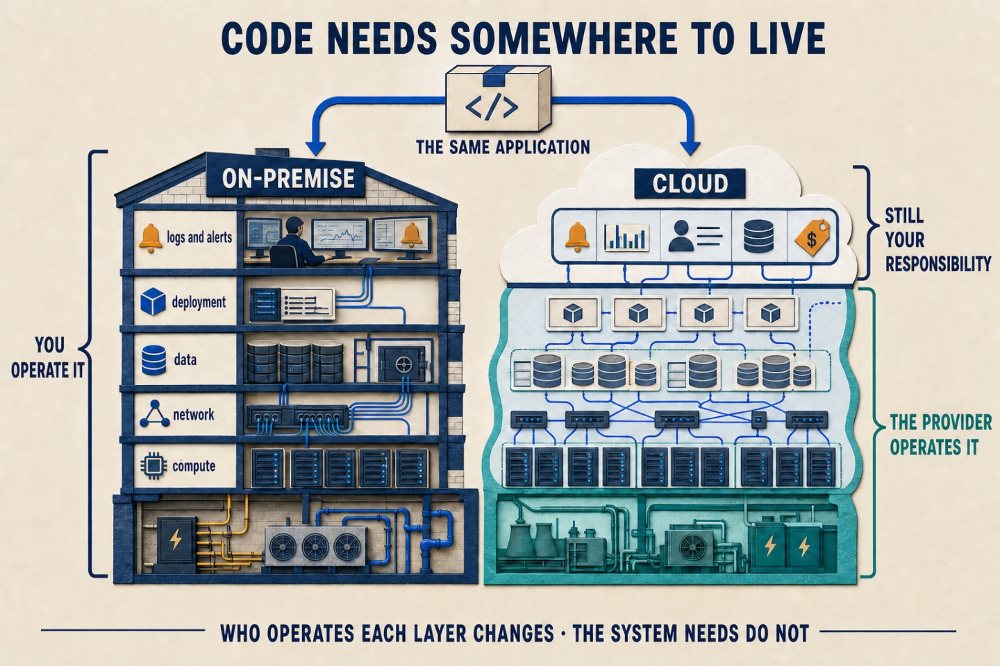

Infrastructure is **everything that lets an application reach its users, keep
running, and change without leaving the service broken**. It includes machines,
networking, storage, and the tools used to deploy, protect, and observe it.

Code does not float in the air. An online shop needs CPU and memory to run its
backend, somewhere to serve the frontend from, a network that receives requests,
a database, and storage that keeps its information safe.

## An application needs an address

An application can run on a machine and listen on a port. For example, a web
server handles HTTP on port `80` or HTTPS on `443`. But nobody wants to visit an
IP address such as `203.0.113.42`: they want to type `nicovegasr.com`.

You buy the domain from a *registrar*. You then configure its *nameservers* to
say which DNS servers know the answers for that domain. When a browser asks for
`nicovegasr.com`, DNS returns a destination address — an IP address or another
name — and only then does the browser open a connection to the application.

DNS does not redirect traffic: it resolves a name. The HTTP or HTTPS request
then travels to that destination. HTTPS adds a certificate to encrypt the
communication and confirm you are talking to the right domain.

## Keeping it available is continuous work

Publishing an application is only the beginning. You have to update the
operating system, apply security patches, watch available disk space, keep
backups, and know what happens when something fails.

You also need to think about bad days. If one machine fails, is there another
one ready to handle traffic? If checkout fails for ten minutes, does anyone get
an alert? Logs, metrics, alerts, load balancers, and backups turn those questions
into decisions you can prepare before the incident.

## On-premise: you operate the machines

With *on-premise* infrastructure, the organisation controls its own servers,
whether they are in an office or a data centre. It decides which hardware to
buy, how to build the network, when to add capacity, and how to protect its
facilities.

That control may matter for performance, regulation, or integration with
internal systems. It also means dealing with failures, electricity, patches,
backups, and the capacity you will need six months from now.

Building a resilient environment needs redundancy: backup machines, tested
backups, duplicated networking, and a plan for restoring service. When it is
properly sized and operated, it can make economic sense; improvising it is often
expensive when the first serious failure happens.

## Cloud: you rent resources and services

In the cloud, a provider offers compute, networking, and storage on demand. As
well as renting machines, you can use managed services: a database, queue, or
load balancer whose underlying operation is handled by the provider.

That makes it possible to create resources quickly and scale without buying
hardware in advance. It does not remove the work: permissions still need
configuring, costs need watching, backups need designing, and the provider's
limits and dependencies need accepting.

⚠️ On-premise offers more control but leaves you operating more things. Cloud
delegates some of that work but does not make infrastructure disappear. The real
difference is who is responsible for each layer and what it costs to run.

## Infrastructure also delivers changes

An application is not deployed only once. Each version needs to go through test
environments and reach production without interrupting the people using it.
Continuous integration (CI) runs automated checks; continuous delivery or
deployment (CD) prepares and automates the path to production.

You do not always release a version to everyone at once. A *canary* deployment
exposes it to a small part of the traffic first. If errors increase or metrics
worsen, you can stop it or return to the previous version. Infrastructure is not
only servers: it is also the tests, automation, and signals that let an
application evolve safely.
