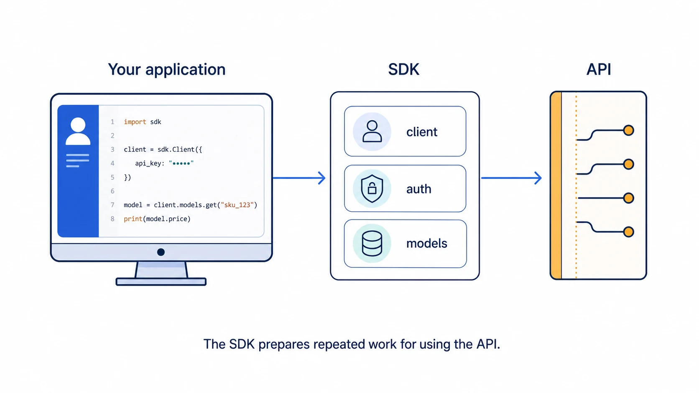

An SDK (*Software Development Kit*) is **a set of tools for integrating your
application with a platform**. It commonly includes libraries, examples,
documentation, and utilities so you do not have to build every piece yourself.

## An API and an SDK are not the same

The API is the **contract**: which operations exist, which data they accept, and
what they return. An SDK is a convenient way to use that contract from a
particular language or environment.

An online shop can offer an HTTP API for creating orders. Its JavaScript SDK can
give you a ready-made function that calls that API, authenticates you, and turns
the response into objects your application understands.



## What it saves you from doing

Without an SDK, you may need to prepare each request, attach authentication
headers, interpret errors, and transform JSON. With one, the intent stays
closer to the code:

```js
const order = await shop.orders.create({
  items: [{ productId: 'backpack', quantity: 1 }],
});
```

The SDK can handle `POST /orders`, the token, and response conversion behind the
scenes. It does not add capabilities to the API: **it packages repeated
decisions so using it is easier and less error-prone**.

## When it is useful

An SDK is worthwhile when you will integrate several parts of a platform or
want to use already-solved typed models, retries, and error handling. It is
often the fastest way to get started as well.

⚠️ It is neither required nor always the best layer. It may lag behind the API,
hide details you need to control, or add too much dependency. If you only need
one very specific operation, calling the API directly may be clearer.
