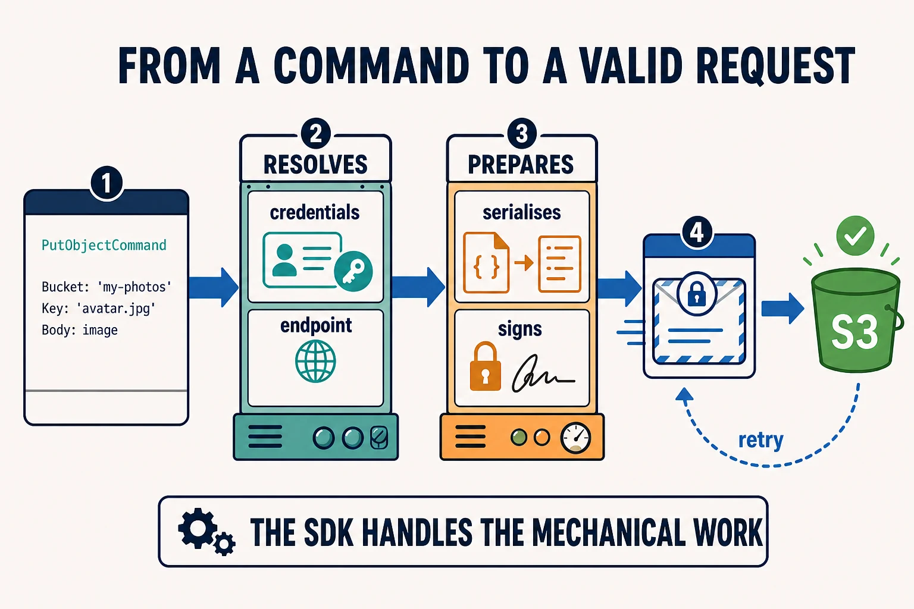

An SDK (*Software Development Kit*) is **a package prepared for building
software on top of a platform**. The library you call from your code is its most
visible part, but the kit can also include types, configuration, tools,
documentation, and examples.

## Uploading a file to Amazon S3

The AWS SDK for JavaScript provides an S3 client. To upload an object, you give
it the region, bucket, name, and contents:

```js
import { PutObjectCommand, S3Client } from '@aws-sdk/client-s3';

const s3 = new S3Client({ region: 'eu-west-1' });

await s3.send(new PutObjectCommand({
  Bucket: 'my-photos',
  Key: 'avatar.jpg',
  Body: image,
}));
```

That code looks small because the SDK handles the mechanical work underneath:

- Finds credentials in the configured sources
- Resolves the endpoint for the selected region
- Turns `PutObjectCommand` into an HTTP request
- Signs the request so AWS can authenticate it
- Interprets the response and retries certain temporary failures



## Why it is called a kit

What we install in the example is the S3 module from the AWS SDK for JavaScript.
The complete ecosystem brings together clients for its services, commands,
types, credential providers, configuration, and shared utilities. **It does not
only define what you can call: it prepares the environment for building with
it.**

The SDK does not remove decisions. You still choose the region, which
credentials will be available, which bucket to write to, and when to override
the default configuration. The kit knows AWS's rules and automates the
repetitive part.

## The SDK has an API too

`S3Client`, `PutObjectCommand`, and `send` form an API used by your code. The SDK
in turn consumes the S3 API underneath. They are not opposing concepts: the SDK
is the set of tools, and its APIs are the contracts through which you use them.

## When it is useful

An SDK pays off when it signs requests, resolves credentials, provides types, or
standardises errors and retries that you would otherwise need to implement and
maintain yourself.

⚠️ That convenience also adds a dependency and can hide details you need to
control. Using an SDK does not mean you can ignore the service's security,
costs, or behaviour.
