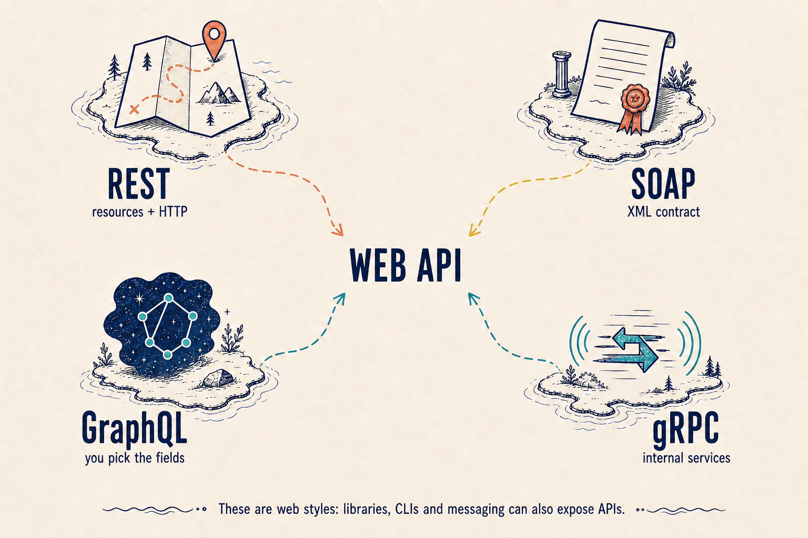

APIs come in many forms: a library, a CLI or a messaging topic are APIs too.
But when we talk about a web API, these four styles come up most often.

## REST: resources and HTTP

REST organises an API around **resources**: products, orders or users. The URL
identifies the resource and the HTTP method expresses the action:

```http
GET /products/42

{ "id": 42, "name": "Backpack", "price": 59 }
```

It commonly uses JSON and works especially well for straightforward CRUD
operations. It is not a protocol or a specific implementation: it is a set of
constraints for designing the interface.

## SOAP: a formal contract

SOAP defines operations and XML messages through an explicit contract, usually a
WSDL. The request does not say “give me this resource”; it says “run this
operation”.

```xml
<GetOrder><id>42</id></GetOrder>
```

It is more rigid and verbose than REST, but that formality remains useful in
enterprise integrations where the contract and its rules must be tightly
defined.

## GraphQL and gRPC: two other approaches

With **GraphQL**, the client selects the exact fields it needs in a query against
a schema. A screen can therefore ask for a name and price without receiving
fields it will not use.

With **gRPC**, services declare their calls and messages in Protocol Buffers. It
is common between internal services: the contract generates typed clients and
communication is compact and efficient.



⚠️ REST, SOAP, GraphQL and gRPC are not “the four types of APIs”. They are four
styles often seen on the web. The same contract idea also appears in a function,
a command or a Kafka message.
