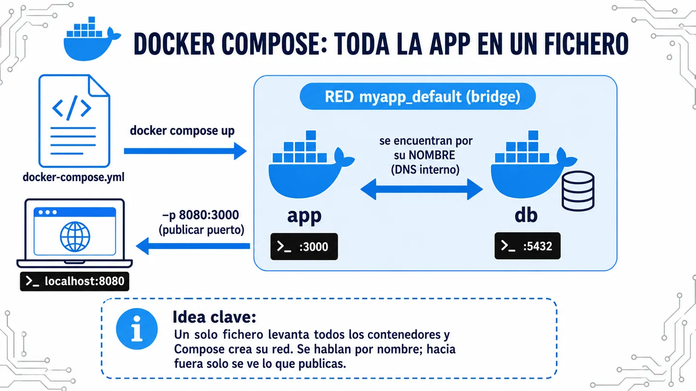

Docker Compose te deja definir **toda tu aplicación —varios contenedores— en un solo fichero YAML** y levantarla con un comando. En vez de lanzar cada `docker run` a mano y acordarte de las redes, los puertos y el orden, lo declaras una vez en `docker-compose.yml`.



⚠️ Compose crea **automáticamente** una red bridge propia del proyecto (`<proyecto>_default`) y conecta todos los servicios a ella. Por eso **se ven entre sí por el nombre del servicio** (DNS) — exactamente la red que en la píldora de redes había que montar a mano.

## Ejemplo de uso

Una app y su base de datos, cada una en su contenedor:

```yaml
# docker-compose.yml
services:
  app:
    image: mi-app:1.0
    ports:
      - "8080:3000"
    environment:
      DATABASE_URL: postgres://db:5432/mydb   # 'db' = nombre del servicio
    depends_on:
      - db

  db:
    image: postgres:16
    environment:
      POSTGRES_PASSWORD: secret
```

La app se conecta a la base escribiendo `db` como si fuera su dirección. No necesita saber su IP: Compose puso los dos contenedores en la misma red y ahí `db` se resuelve solo. Antes lanzabas dos `docker run` y creabas la red a mano; ahora es un fichero y un `docker compose up`.

## Comandos básicos

```bash
docker compose up -d      # construye y levanta todo en segundo plano
docker compose ps         # ver los servicios y su estado
docker compose logs -f    # seguir los logs de todos los servicios
docker compose down       # parar y eliminar contenedores y red
```
