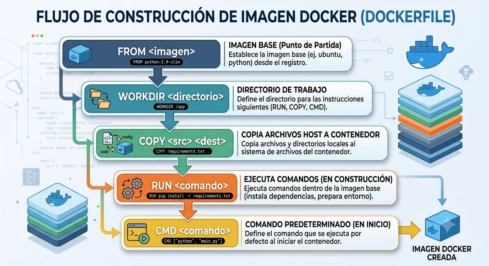
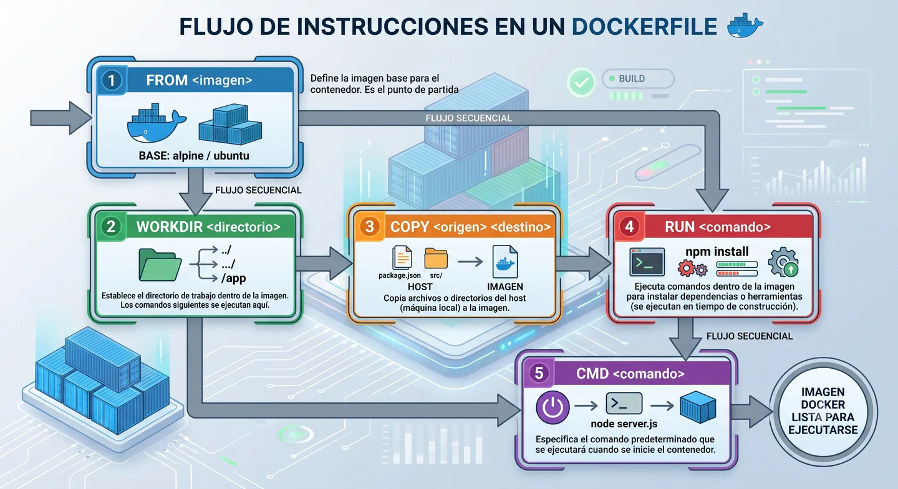
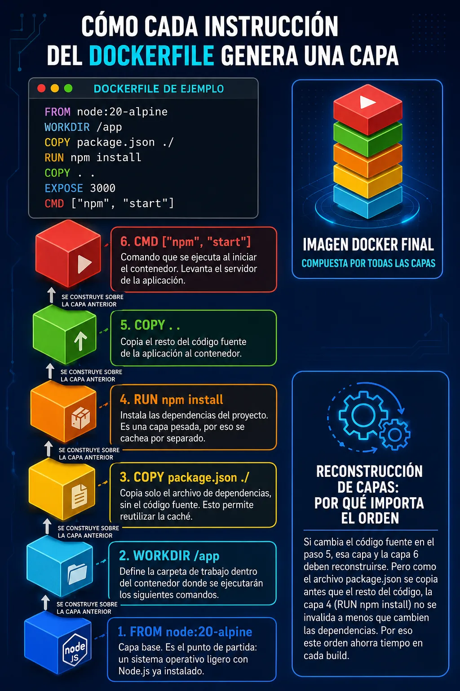

Un Dockerfile es un archivo de texto plano donde definimos las instrucciones que Docker debe ejecutar para construir una imagen.

Podemos verlo como la receta de nuestra aplicación: qué imagen base usamos, qué archivos copiamos, qué dependencias instalamos y qué comando se ejecuta al arrancar el contenedor.

## Qué problema resuelve

Resuelve la necesidad de construir entornos de forma declarativa y reproducible.

En vez de configurar servidores manualmente, dejamos por escrito cómo se debe preparar la imagen de nuestra aplicación. Esto reduce errores, facilita los despliegues y permite que cualquier persona del equipo pueda construir el mismo entorno.

## Cómo funciona internamente

Cuando ejecutas `docker build`, Docker lee el Dockerfile instrucción por instrucción y genera capas dentro de la imagen.

Cada instrucción (`FROM`, `RUN`, `COPY`, etc.) crea una capa nueva. Estas capas se apilan hasta formar la imagen final y Docker puede reutilizarlas mediante caché si no han cambiado.

Esto es clave por dos motivos:

1. **Caché de build:** si una capa no cambió respecto al build anterior, Docker la reutiliza. Por eso el orden importa: primero conviene poner lo que cambia menos, como las dependencias, y después el código fuente.
2. **Inmutabilidad:** una vez creada, una capa no se modifica. Si algo cambia, Docker genera una capa nueva encima.

Las instrucciones principales que vas a usar casi siempre:

| Instrucción | Qué hace |
|---|---|
| `FROM` | Define la imagen base de partida |
| `WORKDIR` | Establece el directorio de trabajo dentro del contenedor |
| `COPY` / `ADD` | Copia archivos del host a la imagen |
| `RUN` | Ejecuta un comando durante el build (instalar dependencias, compilar, etc.) |
| `ENV` | Define variables de entorno disponibles en el contenedor |
| `EXPOSE` | Documenta qué puerto usa la aplicación (no lo publica, solo informa) |
| `USER` | Define con qué usuario corre el proceso |
| `CMD` / `ENTRYPOINT` | Define el comando que se ejecuta al arrancar el contenedor |
| `ARG` | Define variables disponibles solo durante el build |
| `HEALTHCHECK` | Define cómo comprobar si el contenedor está "sano" |

Existen más instrucciones (`VOLUME`, `LABEL`, `SHELL`, `ONBUILD`, `STOPSIGNAL`, etc.), pero son de uso más puntual. Puedes consultar la lista completa en la [documentación oficial de Dockerfile](https://docs.docker.com/reference/dockerfile/).



### COPY vs ADD

En el caso básico hacen lo mismo: copiar archivos del host a la imagen.

La diferencia es que `ADD` puede descomprimir archivos `.tar` automáticamente y copiar desde una URL remota. Como tiene más comportamiento implícito, la práctica habitual es usar `COPY` y reservar `ADD` solo para casos concretos.

### CMD vs ENTRYPOINT

No son dos formas de hacer lo mismo; se pueden combinar.

- `ENTRYPOINT` define el ejecutable principal del contenedor.
- `CMD` define los argumentos por defecto, y se puede sobrescribir al lanzar `docker run`.

```dockerfile
ENTRYPOINT ["node"]
CMD ["index.js"]
```
```bash
docker run mi-app              # ejecuta: node index.js
docker run mi-app otro.js      # ejecuta: node otro.js (solo cambia el argumento)
```

Regla práctica: si el contenedor solo ejecuta una aplicación, con `CMD` suele ser suficiente. Si funciona más como una herramienta con distintos argumentos, `ENTRYPOINT` + `CMD` puede tener más sentido.


