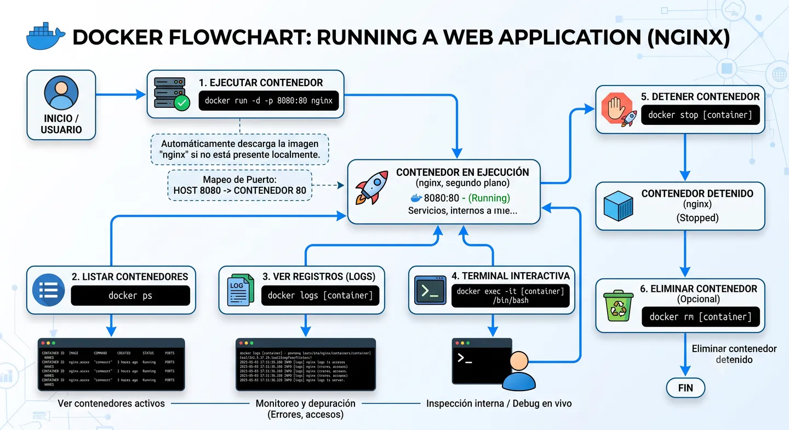
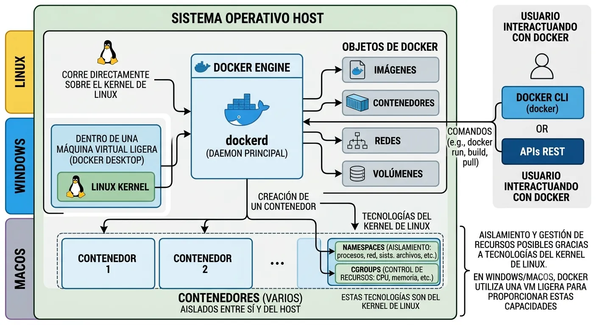

Docker es una plataforma abierta para desarrollar, enviar y ejecutar aplicaciones.

Permite empaquetar una aplicación junto con todo lo que necesita para funcionar: dependencias, configuración y entorno de ejecución. De esta forma, el mismo software puede ejecutarse de forma consistente en local, testing o producción.

## Qué problema resuelve

Surge para resolver uno de los problemas más habituales en desarrollo: "en mi máquina funciona".

Docker ayuda a que una aplicación se ejecute igual en distintos entornos, reduciendo problemas de configuración, dependencias incompatibles o diferencias entre sistemas operativos.

También facilita el despliegue, ya que podemos construir una imagen una vez y ejecutarla tantas veces como necesitemos.

## Cómo funciona internamente

Docker funciona usando tecnologías del kernel de Linux, como `namespaces` y `cgroups`, para crear entornos aislados llamados contenedores.

Cuando ejecutas un contenedor, Docker aísla sus procesos, red y sistema de archivos. Esto permite que cada contenedor funcione de forma independiente dentro del mismo host, sin interferir con otros contenedores o con la máquina principal.

Docker Engine es el componente principal. Funciona con una arquitectura cliente-servidor:

- **Docker daemon (`dockerd`)**: gestiona imágenes, contenedores, redes y volúmenes.
- **Docker CLI (`docker`)**: permite interactuar con el daemon mediante comandos.

