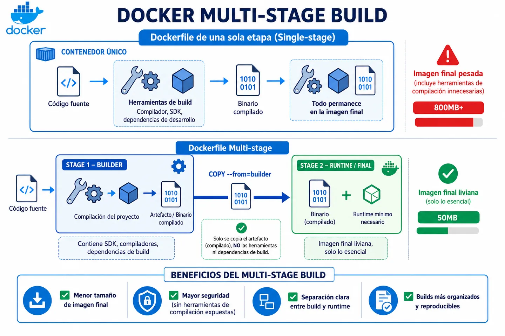

Multi-stage build es una funcionalidad de Docker que permite usar varias instrucciones `FROM` dentro de un mismo Dockerfile.

Cada `FROM` crea una etapa independiente. Normalmente usamos una etapa para construir la aplicación y otra para generar la imagen final que se ejecutará en producción.



## Qué problema resuelve

Surge para reducir el tamaño final de las imágenes Docker.

Sin multi-stage, la imagen final suele arrastrar todo lo que se usó durante el build: compiladores, dependencias de desarrollo, cachés, código fuente sin transpilar, etc.

Esto aumenta el tamaño de la imagen, ralentiza los despliegues y también incrementa la superficie de ataque, ya que estamos incluyendo herramientas que no necesitamos en producción.

Multi-stage separa dos momentos:

- **Build:** todo lo necesario para compilar o preparar la aplicación.
- **Runtime:** solo lo necesario para ejecutarla.

## Cómo funciona internamente

Cada `FROM` dentro del Dockerfile crea una etapa aislada, con su propio sistema de archivos.

Las etapas no comparten nada automáticamente. Si queremos pasar algo de una etapa a otra, tenemos que copiarlo explícitamente con `COPY --from=<etapa>`.

Podemos nombrar una etapa con `AS nombre` para referenciarla después:

```dockerfile
FROM node:20 AS builder
```

La imagen final será la última etapa del Dockerfile. Las anteriores se usan durante el build, pero no forman parte del resultado final salvo que copiemos archivos desde ellas.

## Ejemplo de uso

**Sin multi-stage:** la imagen final arrastra todo lo usado durante el build.

```dockerfile
FROM node:20
WORKDIR /app
COPY package*.json ./
RUN npm ci
COPY . .
RUN npm run build
CMD ["node", "dist/index.js"]
```

**Con multi-stage:** la imagen final solo contiene lo necesario para ejecutar la aplicación.

```dockerfile
FROM node:20 AS builder
WORKDIR /app
COPY package*.json ./
RUN npm ci
COPY . .
RUN npm run build

FROM node:20-alpine
WORKDIR /app
COPY --from=builder /app/dist ./dist
COPY --from=builder /app/node_modules ./node_modules
USER node
CMD ["node", "dist/index.js"]
```
