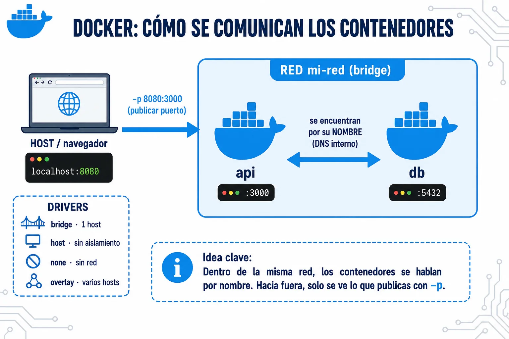

Una red de Docker es el sistema que permite a los contenedores **comunicarse entre sí y con el exterior**. Docker crea redes virtuales aisladas y conecta los contenedores a ellas, controlando qué puede hablar con qué.



⚠️ La red `bridge` **por defecto** (la que existe sin crear nada) NO tiene DNS interno entre contenedores — solo las redes bridge creadas explícitamente con `docker network create` lo tienen. Es la trampa más común: dos contenedores en la red default no se resuelven por nombre.

## Ejemplo de uso

En la práctica casi siempre usas una red `bridge` creada por ti — que es justo lo que Docker Compose monta por debajo sin que te enteres.

```bash
docker network create mi-red

docker run -d --name db  --network mi-red postgres:16
docker run -d --name app --network mi-red -p 8080:3000 mi-app:1.0   # tu imagen
```

Todos los contenedores en `mi-red` se ven entre sí por nombre (DNS): dentro de `app` te conectas a la base con `db:5432`, sin saber su IP. Hacia fuera solo asoma lo que publicas con `-p`.

> Existen otros drivers para casos concretos — `host` (comparte la red del host, sin aislamiento), `none` (sin red) y `overlay` (varias máquinas, la base de Docker Swarm) — pero en el día a día, y sobre todo con Compose, trabajas con `bridge`.

## Comprobar y limpiar

```bash
docker network ls               # listar redes
docker network inspect mi-red   # ver qué contenedores están conectados
docker network rm mi-red        # eliminar (debe estar sin contenedores)
```
