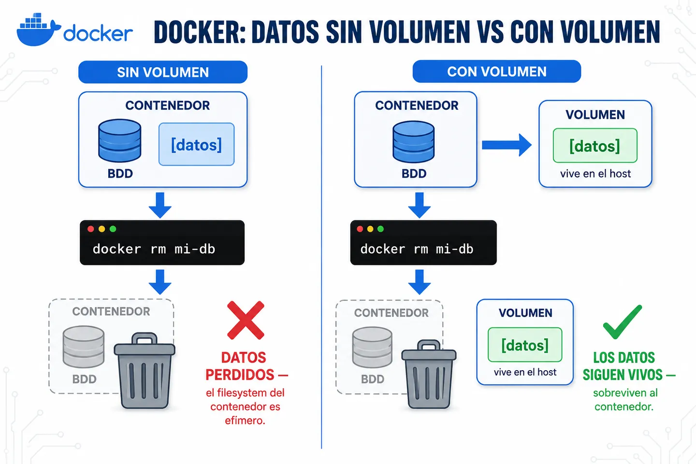
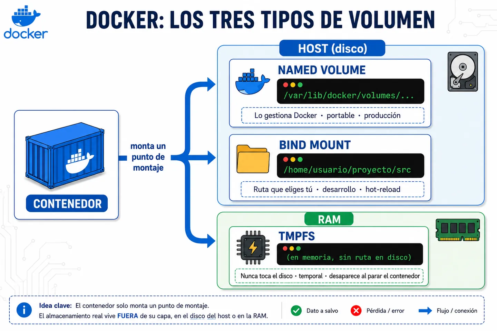

Un volumen es el mecanismo de Docker para persistir datos fuera del ciclo de vida del contenedor.

Es un almacenamiento que vive en el host y se monta dentro del contenedor. Sigue existiendo aunque detengas o elimines el contenedor.

## Qué problema resuelve

Por defecto, el filesystem de un contenedor es efímero: todo lo que se escribe dentro vive en su capa de escritura y se pierde al hacer `docker rm`.

Los volúmenes separan el dato del contenedor que lo usa. Así la información sobrevive a reinicios, actualizaciones de imagen o recreaciones del contenedor, y se puede compartir entre varios contenedores a la vez.



## Cómo funciona internamente

Docker monta el volumen como un punto dentro del filesystem del contenedor, pero el dato real vive fuera de su capa, con un ciclo de vida propio: solo desaparece si lo borras explícitamente.

Hay tres tipos:

- **Named volume**: lo gestiona Docker. Es la opción portable, pensada para producción.
- **Bind mount**: una ruta del host que eliges tú. Típico en desarrollo para hot-reload de código.
- **tmpfs**: vive solo en RAM y nunca toca el disco. Para datos temporales que quieres rápidos o que no deben dejar rastro.

⚠️ Si montas un volumen sobre una ruta que ya tenía contenido en la imagen, ese contenido se sobrescribe.



## Ejemplo de uso

**Named volume:**
```bash
docker volume create db_data
docker run -d --name mi-db -v db_data:/var/lib/postgresql/data postgres:16
```
Si eliminas y recreas `mi-db` apuntando al mismo volumen, los datos siguen ahí.

**Bind mount:**
```bash
docker run -d -v $(pwd)/src:/app/src mi-app:dev
```
Cualquier cambio en `./src` se refleja al instante dentro del contenedor.

**tmpfs:**
```bash
docker run -d --tmpfs /app/cache mi-app:dev
```
Lo que se escribe en `/app/cache` vive solo en RAM y desaparece al detener el contenedor. Es el tipo menos habitual: en la práctica se ve sobre todo en producción/k8s (donde equivale a un `emptyDir` en memoria) para caché temporal rápida o datos que no deben tocar disco. Ojo: consume RAM del host, no lo uses para grandes volúmenes de datos.

**Comprobar y limpiar:**
```bash
docker volume ls              # listar volúmenes
docker volume inspect db_data # ver dónde vive físicamente
docker volume rm db_data      # eliminarlo (¡se pierde el dato!)
```
