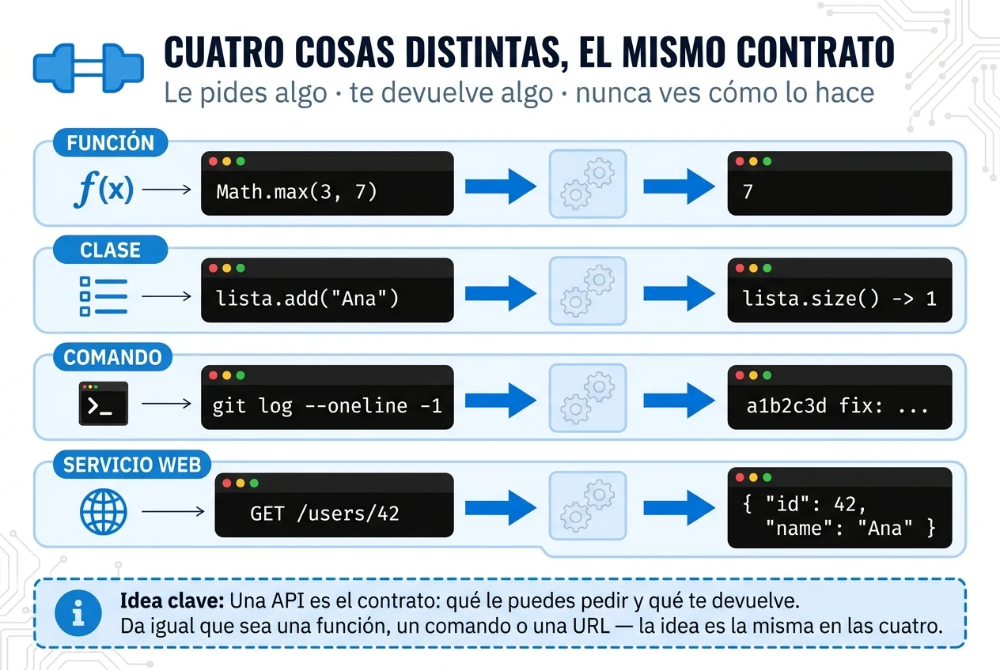

Una API (*Application Programming Interface*) es **el contrato por el que un software deja que otros le pidan cosas**: qué puedes pedirle, cómo pedirlo y qué te devuelve.

## Para qué sirve

Para usar algo sin saber cómo está hecho.

Cuando escribes `Math.max(3, 7)` no sabes con qué algoritmo compara los números, y no te hace falta: sabes que le pasas dos y te devuelve el mayor. Ese acuerdo es la API.

Mientras se respete, quien está al otro lado puede reescribir todo lo de dentro sin romperte nada.



## Todas estas son APIs

**Una función.** Le pasas argumentos, te devuelve algo:

```js
Math.max(3, 7)   // 7
```

**Los métodos públicos de una clase.** Lo que puedes llamar desde fuera:

```java
List<String> lista = new ArrayList<>();
lista.add("Ana");
lista.size();   // 1
```

Por dentro, `ArrayList` guarda un array que va creciendo y se copia cuando se llena. Tú nunca lo tocas.

**Un comando.** Le das argumentos, te devuelve una salida:

```bash
git log --oneline -1
```

**Un servicio web.** Le mandas una petición, te devuelve una respuesta:

```http
GET /users/42

{ "id": 42, "name": "Ana" }
```

Cuatro tecnologías que no se parecen en nada y la misma idea en las cuatro: alguien publica qué se le puede pedir, y tú se lo pides sin mirar dentro.

⚠️ Cambiar una API no es cambiar código: es romper el contrato de todo el que dependía de ella. Por eso se versionan.
