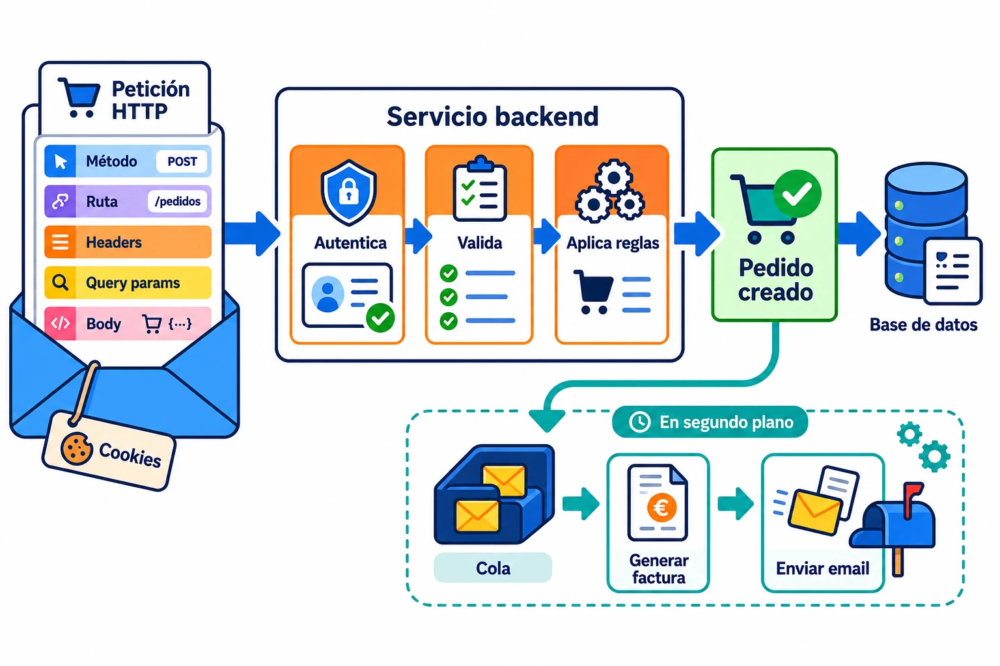

El backend es **la parte de una aplicación que recibe peticiones, aplica las
reglas del sistema y guarda los cambios**. Normalmente se ejecuta en uno o varios
servidores y no lo ves directamente, pero casi todo lo que haces termina pasando
por él.

## Del botón al cambio real

Cuando confirmas un pedido, el frontend recoge los productos y la dirección y
envía una petición. El backend es quien comprueba que los datos son válidos, que
queda stock, que el precio sigue siendo correcto y que esa persona puede hacer
la compra.

Si todo cuadra, descuenta el stock, guarda el pedido y devuelve el resultado. Si
algo falla, responde con un error que el frontend pueda explicar.

La distinción importa porque puede haber más de una forma de usar el mismo
sistema: una web, una app móvil o una integración externa. Si cada cliente
decidiera por su cuenta cuándo se puede comprar, acabarías con tres versiones de
las mismas reglas. El backend las deja en un único sitio.

## No siempre hay alguien esperando

Un backend también trabaja sin que nadie pulse un botón. Puede ejecutar una
tarea programada cada noche, procesar algo pesado en segundo plano o reaccionar
a un evento que publicó otro sistema.

Cuando se crea un pedido, por ejemplo, puede publicar un evento para preparar la
factura. Un *webhook* recorre el camino contrario: el backend llama a otro
servicio para avisarle de que algo ha ocurrido. En ambos casos sigue haciendo lo
mismo: recibir una señal y aplicar una regla.

## La seguridad se decide aquí

El frontend puede ocultar un botón o impedir que abras una ruta, pero cualquiera
puede saltárselo y llamar a la API directamente. Por eso el backend comprueba
quién hace la petición y qué permisos tiene antes de cambiar nada.

La identidad puede llegar en un token o en una sesión mediante cookie. El
mecanismo cambia; la responsabilidad no: **el backend no confía en que el
frontend haya hecho las comprobaciones por él**.

## Lo que significa *stateless*

Muchos backends son *stateless*: cada petición trae lo necesario para
procesarla, como la identidad y los datos de la operación. Así la siguiente
petición puede atenderla otra instancia sin recordar qué ocurrió en la anterior.

⚠️ *Stateless* no significa que la aplicación no guarde datos. El pedido sigue
en la base de datos. Lo que no necesita conservarse es la conversación en la
memoria de un servidor concreto.
