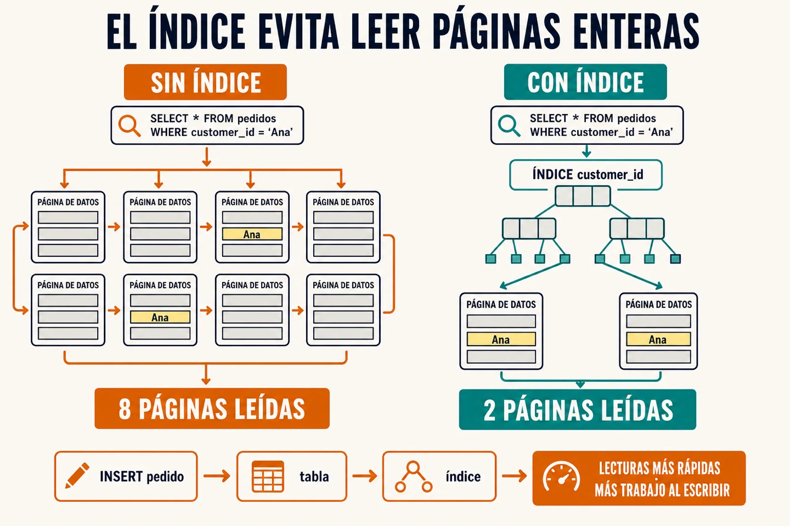

Una base de datos es **un sistema para guardar información, encontrarla y
mantenerla coherente mientras varias operaciones la usan a la vez**. En una
tienda ahí viven los productos, el stock y los pedidos, aunque el backend se
reinicie.

## Cómo guarda la información

En una base de datos relacional, la información se organiza en tablas formadas
por filas y columnas. Una tabla de productos puede tener una fila por producto;
una de pedidos, una por compra. Es la parte que modelas y consultas.

Por debajo hay otra capa que normalmente no ves: el motor agrupa esas filas en
páginas. Puede leerlas desde disco y mantener las que más usa en memoria. La
aplicación no toca esos archivos directamente: envía una consulta y el motor
decide qué páginas necesita leer y qué cambios debe escribir.

## Las conexiones también tienen límite

Abrir una conexión nueva para cada consulta cuesta tiempo y recursos. Por eso el
backend suele mantener un *pool*: un grupo pequeño de conexiones abiertas que
presta a cada operación y recupera cuando termina.

Si todas están ocupadas, las siguientes peticiones esperan. Aumentar el pool sin
medida no crea capacidad gratis; solo permite que más trabajo llegue a la base
de datos al mismo tiempo. Si una consulta tarda dos segundos en vez de veinte
milisegundos, retiene una conexión cien veces más; por eso una consulta lenta
reduce la capacidad de todo el sistema.

## Un índice evita buscar fila por fila

Sin un índice, buscar los pedidos de una persona puede obligar a revisar toda la
tabla. Un índice guarda ciertos valores en una estructura ordenada y apunta a
las páginas donde están las filas relevantes. El motor puede descartar bloques
enteros de datos en vez de comprobarlos uno a uno.

Por eso funcionan tan bien para las columnas por las que filtras, ordenas o
relacionas tablas con frecuencia. Y por eso tampoco conviene crear uno para cada
columna.

Cada `INSERT`, `UPDATE` o `DELETE` tiene que actualizar la tabla y todos los
índices afectados. Ganas velocidad al leer; pagas espacio y trabajo extra al
escribir.

⚠️ Optimizar no es coleccionar trucos. Primero mira el plan de ejecución:
cuántas filas lee la consulta, qué índices usa y dónde dedica el tiempo. Sin esa
información, añadir un índice o reescribir SQL es apostar.

## La base de datos también protege el modelo

Una base de datos relacional no solo guarda lo que le envías: puede rechazar
datos que no cumplen el modelo. `NOT NULL` obliga a proporcionar un valor;
`UNIQUE` evita duplicados, como dos cuentas con el mismo email; `CHECK` puede
impedir que el stock sea negativo.

Las claves foráneas protegen las relaciones entre tablas. Un pedido no puede
referirse a un producto que no existe, y no puedes borrar ese producto mientras
todavía haya pedidos que lo necesiten. Estas reglas se aplican incluso si otro
proceso escribe directamente en la base de datos.

Esto no sustituye al backend: ahí siguen viviendo reglas como si una persona
puede usar un cupón o comprar un producto. Pero las restricciones hacen que un
error, una integración o un script no puedan dejar el modelo en un estado que la
base de datos ya sabe que es imposible.
