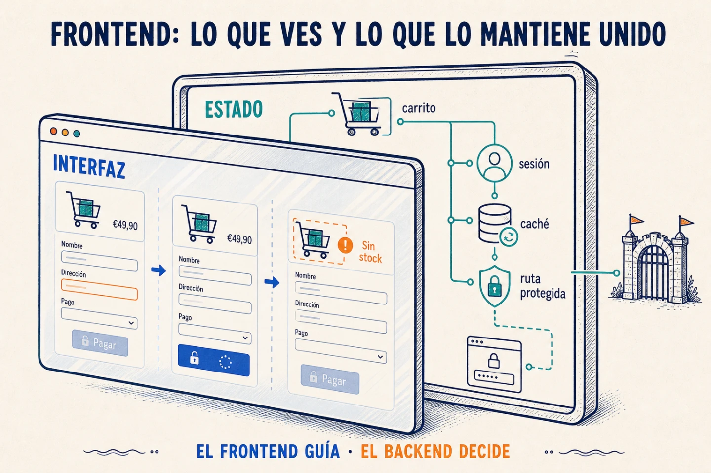

Un frontend web es **el conjunto de HTML, CSS y JavaScript que un servidor
entrega al navegador para construir una interfaz**.

El HTML define la estructura, el CSS decide cómo se ve y el JavaScript permite
que cambie y responda a cada acción. Al final, por mucho React, Vue o Angular que
uses, el navegador solo entiende esas tres cosas.

## Antes de llegar al navegador

Cuando lanzas `npm run dev`, normalmente arrancas un servidor de desarrollo.
Herramientas como Vite transforman el código y actualizan el navegador en
caliente cada vez que guardas un fichero. Está pensado para que desarrollar sea
cómodo, no para recibir tráfico real.

Para publicar la aplicación ejecutas un *build*. El empaquetador recorre el
código, elimina lo que no usas, divide el resultado y genera algo parecido a
esto:

```text
dist/
├── index.html
├── assets/app-a91f2.js
├── assets/styles-77c3a.css
└── assets/logo-2d10f.webp
```

Esos archivos se pueden servir con Nginx, un bucket o un CDN. Los nombres con
hash permiten cachearlos durante mucho tiempo: si cambia el contenido, cambia
también la URL y el navegador descarga la nueva versión.

Hay excepciones. Un frontend con renderizado en servidor —SSR— puede necesitar
un proceso en producción que construya el HTML de cada petición. Pero incluso
entonces el navegador termina recibiendo HTML, CSS y JavaScript.

## Dentro del navegador

El navegador convierte el HTML en un árbol de objetos llamado **DOM**.
JavaScript puede añadir nodos, cambiar texto o eliminar elementos, y el
navegador vuelve a pintar lo necesario.

Para decidir qué pintar, la aplicación necesita saber qué está pasando. Si el
carrito aparece en la cabecera y en el checkout, los dos tienen que mostrar los
mismos productos. Esa información es **estado**.

Si un dato solo lo usa un componente, puede vivir ahí. Si también lo necesitan
sus hijos, puede bajar por propiedades. El *prop drilling* aparece cuando
atraviesa varios componentes que no lo usan solo para llegar a otro; Context,
Redux o Zustand permiten compartirlo sin pasar por toda la cadena.

No se trata de guardar todo globalmente. Cuanto más cerca viva un dato de donde
se consume, menos partes de la aplicación pueden cambiarlo o depender de él sin
necesidad.

React conecta ese estado con la pantalla mediante una representación en memoria
llamada *virtual DOM*. Cuando el estado cambia, compara el resultado anterior
con el nuevo y aplica al DOM real los cambios necesarios. No es otro tipo de
HTML ni algo que entienda el navegador: es una estrategia de React para decidir
qué tocar.

Las rutas resuelven una pregunta parecida: qué interfaz corresponde a cada URL.
React Router puede decidirlo en el navegador; Astro puede generar el HTML durante
el build; Next.js también puede renderizarlo en el servidor.



## Cuando habla con el backend

Imagina que vas a confirmar un pedido. El frontend ya sabe si falta la dirección,
así que puede mantener el botón desactivado. Cuando lo pulsas, puede bloquearlo
mientras espera para no enviar la operación dos veces. Y si el backend responde
que un producto se ha quedado sin stock, puede señalar cuál es y qué puedes hacer
ahora.

Aquí se cruzan la parte visual y la técnica. La pantalla tiene que representar
si la petición está cargando, si terminó o si falló; el backend tiene que
devolver errores que el frontend pueda convertir en mensajes útiles.

Los datos que llegan de la API son **estado remoto**. La lista de productos que
ves es una copia y puede quedarse antigua. Una caché de peticiones puede
reutilizarla durante un tiempo —un TTL de cinco minutos, por ejemplo— y evitar
nuevas llamadas de red. También necesita saber cuándo invalidarla: después de
crear un pedido quizá haya que consultar el stock aunque el TTL no haya
terminado.

La sesión sigue el mismo recorrido. El frontend puede usarla para proteger una
ruta y mandarte al login antes de mostrar una pantalla privada. Eso mejora la
experiencia, no la seguridad: cualquiera puede modificar el navegador o llamar
a la API directamente, así que el backend vuelve a comprobar los permisos.

⚠️ Un frontend no es solo “la parte bonita”, pero tampoco es un segundo backend.
Es el código que llega al navegador y mantiene la interfaz coherente mientras
alguien la usa.
