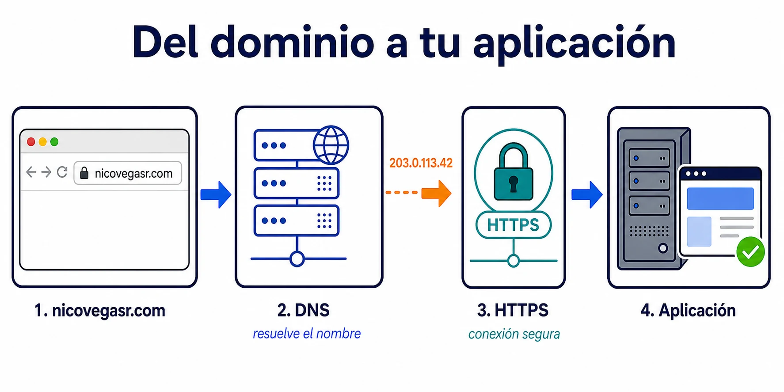

La infraestructura es **todo lo que permite que una aplicación llegue a sus
usuarios, siga funcionando y pueda cambiar sin dejar el servicio roto**. Incluye
las máquinas, la red, el almacenamiento y las herramientas con las que se
despliega, protege y observa.

El código no flota en el aire. Una tienda necesita CPU y memoria para ejecutar
el backend, un lugar desde el que servir el frontend, una red que reciba las
peticiones, una base de datos y almacenamiento para no perder información.

## Una aplicación necesita una dirección

Una aplicación puede ejecutarse en una máquina y escuchar un puerto. Por
ejemplo, un servidor web atiende HTTP en el puerto `80` o HTTPS en el `443`.
Pero nadie quiere visitar una IP como `203.0.113.42`: quiere escribir
`nicovegasr.com`.

El dominio se compra a un *registrar*. Después configuras sus *nameservers* para
indicar qué servidores DNS conocen las respuestas de ese dominio. Cuando el
navegador pregunta por `nicovegasr.com`, DNS le devuelve una dirección de destino
—una IP u otro nombre— y solo entonces el navegador abre la conexión hacia la
aplicación.

DNS no redirige el tráfico: resuelve un nombre. La petición HTTP o HTTPS viaja
después a ese destino. HTTPS añade un certificado para cifrar la comunicación y
comprobar que hablas con el dominio correcto.

## Mantenerla disponible es el trabajo continuo

Publicar la aplicación es solo el principio. Hay que actualizar el sistema
operativo, aplicar parches de seguridad, vigilar el espacio disponible, guardar
copias de seguridad y saber qué ocurre cuando algo falla.

También hay que pensar en los días malos. Si una máquina cae, ¿hay otra que
pueda atender el tráfico? Si el proceso de pago falla durante diez minutos,
¿alguien recibe una alerta? Logs, métricas, alertas, balanceadores y copias de
seguridad convierten esas preguntas en decisiones que puedes preparar antes del
incidente.

## On-premise: tú operas las máquinas

En *on-premise*, la organización controla sus propios servidores, ya estén en
una oficina o en un centro de datos. Decide qué hardware compra, cómo monta la
red, cuándo amplía la capacidad y cómo protege las instalaciones.

Ese control puede ser importante por rendimiento, regulación o integración con
sistemas propios. También significa encargarse de las averías, la electricidad,
los parches, las copias y la capacidad que necesitarás dentro de seis meses.

Construir un entorno resistente requiere redundancia: máquinas de respaldo,
copias verificadas, red duplicada y un plan para recuperar el servicio. Bien
dimensionado y operado puede tener sentido económico; improvisarlo suele ser
caro cuando llega el primer fallo serio.

## Cloud: alquilas recursos y servicios

En cloud, un proveedor ofrece computación, red y almacenamiento bajo demanda.
Además de alquilar máquinas, puedes usar servicios gestionados: una base de
datos, una cola o un balanceador que el proveedor opera por debajo.

Eso permite crear recursos rápido y escalar sin comprar hardware por adelantado.
No elimina el trabajo: todavía hay que configurar permisos, vigilar costes,
diseñar copias de seguridad y asumir los límites y dependencias del proveedor.

⚠️ On-premise da más control, pero obliga a operar más cosas. Cloud delega parte
de ese trabajo, pero no hace desaparecer la infraestructura. La diferencia real
es quién se responsabiliza de cada capa y cuánto cuesta hacerlo.

## La infraestructura también entrega cambios

La aplicación no se despliega una sola vez. Cada versión necesita pasar por
entornos de prueba y llegar a producción sin interrumpir a quienes la usan.
La integración continua (CI) ejecuta comprobaciones automáticas; la entrega o el
despliegue continuos (CD) preparan y automatizan el camino hacia producción.

No siempre se publica una versión para todo el mundo a la vez. Un despliegue
*canary* la expone primero a una parte pequeña del tráfico. Si aumentan los
errores o empeoran las métricas, puedes detenerla o volver a la versión anterior.
Por eso infraestructura no significa solo servidores: también es la red de
pruebas, automatizaciones y señales que permite evolucionar una aplicación con
seguridad.
