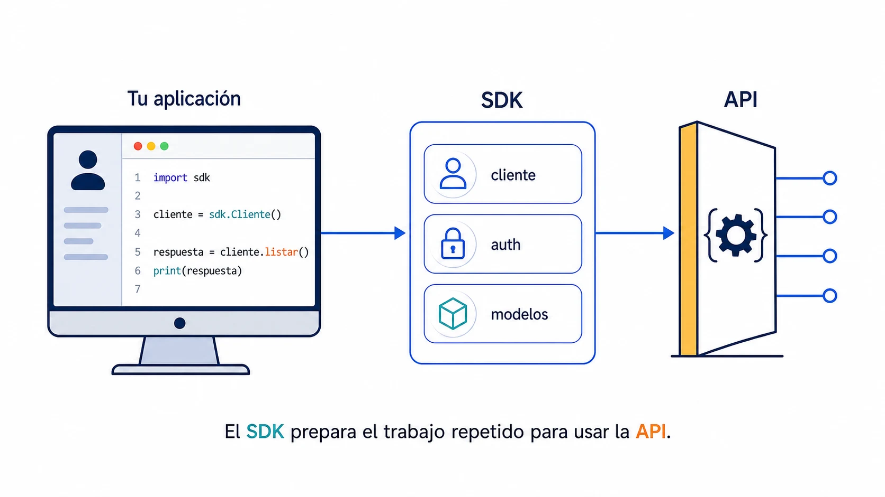

Un SDK (*Software Development Kit*) es **un conjunto de herramientas para
integrar tu aplicación con una plataforma**. Suele incluir librerías, ejemplos,
documentación y utilidades para no tener que construirlo todo desde cero.

## API y SDK no son lo mismo

La API es el **contrato**: qué operaciones existen, qué datos reciben y qué
responden. Un SDK es una forma cómoda de usar ese contrato desde un lenguaje o
entorno concreto.

Una tienda puede ofrecer una API HTTP para crear pedidos. Su SDK de JavaScript
puede darte una función ya preparada para llamar a esa API, autenticarte y
convertir la respuesta en objetos que entiende tu aplicación.



## Qué te ahorra

Sin SDK, quizá tengas que preparar cada petición, adjuntar las cabeceras de
autenticación, interpretar errores y transformar JSON. Con uno, la intención
queda más cerca del código:

```js
const order = await shop.orders.create({
  items: [{ productId: 'backpack', quantity: 1 }],
});
```

El SDK puede encargarse por debajo de `POST /orders`, del token y de convertir
la respuesta. No añade capacidades a la API: **empaqueta decisiones repetidas
para que usarla sea más fácil y menos propenso a errores**.

## Cuándo conviene usarlo

Un SDK merece la pena cuando vas a integrar varias partes de una plataforma o
quieres aprovechar modelos tipados, reintentos y manejo de errores ya resueltos.
También suele ser el camino más rápido para empezar.

⚠️ No es obligatorio ni siempre la mejor capa. Puede ir por detrás de la API,
ocultar detalles que necesitas controlar o añadir una dependencia excesiva. Si
solo haces una operación muy concreta, llamar a la API directamente puede ser
más claro.
