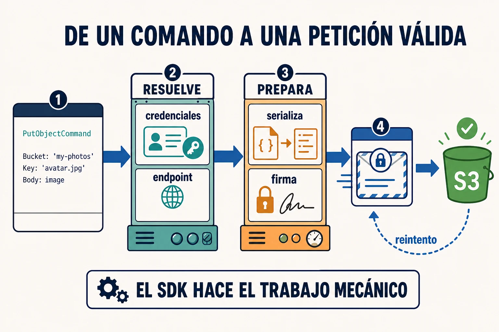

Un SDK (*Software Development Kit*) es **un paquete preparado para desarrollar
software sobre una plataforma**. La librería que llamas desde el código es su
parte más visible, pero el kit también puede incluir tipos, configuración,
herramientas, documentación y ejemplos.

## Subir un archivo a Amazon S3

El SDK de AWS para JavaScript ofrece un cliente de S3. Para subir un objeto le
indicas la región, el bucket, el nombre y el contenido:

```js
import { PutObjectCommand, S3Client } from '@aws-sdk/client-s3';

const s3 = new S3Client({ region: 'eu-west-1' });

await s3.send(new PutObjectCommand({
  Bucket: 'my-photos',
  Key: 'avatar.jpg',
  Body: image,
}));
```

Ese código parece pequeño porque el SDK hace el trabajo mecánico por debajo:

- Busca credenciales en las fuentes configuradas
- Resuelve el endpoint correspondiente a la región
- Convierte `PutObjectCommand` en una petición HTTP
- Firma la petición para que AWS pueda autenticarla
- Interpreta la respuesta y reintenta ciertos fallos temporales



## Por qué se llama «kit»

Lo que instalamos en el ejemplo es el módulo de S3 del SDK de AWS para
JavaScript. El ecosistema completo reúne clientes para sus servicios, comandos,
tipos, proveedores de credenciales, configuración y utilidades compartidas.
**No solo define qué puedes llamar: prepara el entorno para que puedas
desarrollar con él.**

El SDK no elimina las decisiones. Tú sigues eligiendo la región, qué
credenciales estarán disponibles, a qué bucket escribir y cuándo cambiar la
configuración por defecto. El kit conoce las reglas de AWS y automatiza su parte
repetitiva.

## El SDK también tiene una API

`S3Client`, `PutObjectCommand` y `send` forman una API que tu código utiliza. A
su vez, el SDK consume por debajo la API de S3. No son conceptos opuestos: el
SDK es el conjunto de herramientas y sus APIs son los contratos con los que las
usas.

## Cuándo conviene usarlo

Un SDK compensa cuando firma peticiones, resuelve credenciales, aporta tipos o
estandariza errores y reintentos que de otro modo tendrías que implementar y
mantener tú.

⚠️ Esa comodidad también añade una dependencia y puede ocultar detalles que
necesites controlar. Usar un SDK no significa que puedas ignorar la seguridad,
los costes o el comportamiento del servicio.
