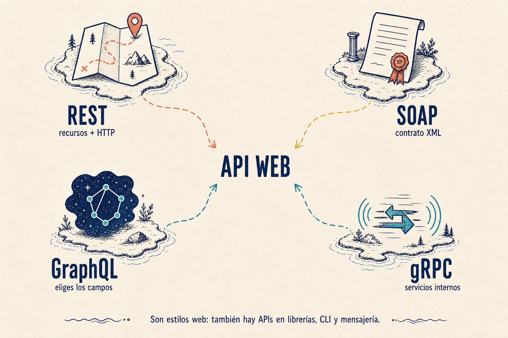

Hay APIs de muchos tipos: una librería, una CLI o un topic de mensajería también
lo son. Pero cuando hablamos de una API web, casi siempre aparecen estos cuatro
estilos.

## REST: recursos y HTTP

REST organiza la API alrededor de **recursos**: productos, pedidos o usuarios.
La URL identifica el recurso y el método HTTP expresa la acción:

```http
GET /products/42

{ "id": 42, "name": "Mochila", "price": 59 }
```

Suele usar JSON y encaja muy bien cuando expones operaciones CRUD sencillas.
No es un protocolo ni una implementación concreta: es un conjunto de
restricciones sobre cómo diseñar la interfaz.

## SOAP: contrato formal

SOAP define operaciones y mensajes XML con un contrato explícito, normalmente
un WSDL. La petición no dice «dame este recurso», sino «ejecuta esta operación».

```xml
<GetOrder><id>42</id></GetOrder>
```

Es más rígido y verboso que REST, pero esa formalidad sigue siendo útil en
integraciones empresariales donde el contrato y las reglas deben estar muy
definidos.

## GraphQL y gRPC: otras dos formas

Con **GraphQL**, el cliente elige los campos exactos que necesita en una consulta
contra un esquema. Así una pantalla puede pedir nombre y precio, sin recibir
campos que no va a usar.

Con **gRPC**, los servicios declaran sus llamadas y mensajes en Protocol Buffers.
Es habitual entre servicios internos: el contrato genera clientes tipados y la
comunicación es compacta y eficiente.



⚠️ REST, SOAP, GraphQL y gRPC no son «los cuatro tipos de API». Son cuatro
estilos muy vistos en web. La misma idea de contrato aparece también en una
función, un comando o un mensaje de Kafka.
