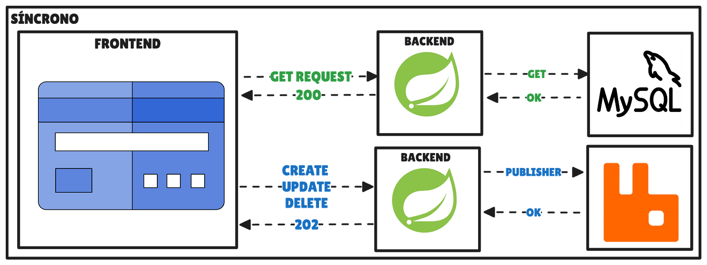
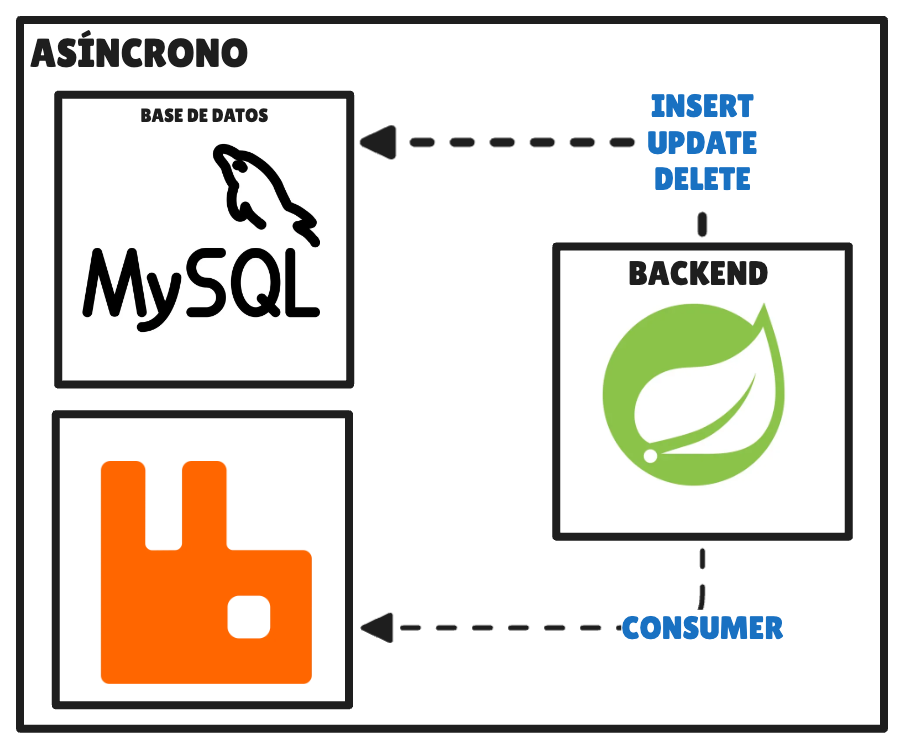

Building a Spring Boot API that handles over 7 million requests a day is possible without scaling vertically or horizontally.



In the market, it's common for a company to develop a product without considering scalability from a development standpoint —mainly to avoid analysis paralysis and validate the idea, or because they don't have the necessary technical knowledge at the time.

When this happens, you generally reach a phase where you have to refactor the application to scale it efficiently and reduce technical debt. This is because, beyond buying more servers or upgrading existing hardware, the opportunity cost you can gain by optimizing the current software architecture is much greater.

## Scalability in software

- **Vertical scaling:** consists of adding more resources to existing hardware: more RAM, memory, etc.
- **Horizontal scaling:** consists of adding new servers. It's the most common option; they're managed through load balancers, Kubernetes clusters, etc.

## Database connections

As a rule, the bottleneck of systems is the database, and it depends on each one's configuration and limitations. This is because databases only allow a finite number of connections to ensure the integrity of the stored data: we can have roughly 100 to 150 connections in the database pool (again, it depends on each engine and configuration).

In a social network with millions of users creating posts, commenting, and interacting with each other, it's essential to guarantee service levels that ensure a smooth user experience.

To achieve this, there are several infrastructure-level solutions —such as database partitioning or read/write replication setups with periodic synchronization—, although all of them involve additional technical effort and a higher hardware cost.

However, we can also adopt architecture strategies at the development level that let us offer an API capable of handling millions of requests without relying solely on the database's scalability.

- **Request caching:** implementing caching systems lets us answer many requests without accessing the main database, drastically reducing the load on it and improving response time.
- **Asynchronous and batch processing:** although GET requests must be resolved in real time, the same isn't true for create, update, or delete operations on resources. These can be processed asynchronously. If we also group multiple operations coming from different users to process them in batches, the number of connections needed with the database drops considerably, increasing the system's efficiency and scalability.

## Practical case

**Scenario:** develop a CRUD API for creating posts and comments in a social network with millions of daily active users.

The technologies to use are:

- Java
- Spring framework: Boot, Data (Hibernate and JPA)
- RabbitMQ
- MySQL
- Load testing: K6

### General schema




The idea is to build a backend that fetches resources through GET requests in real time, while the rest of the more expensive operations —create, update, or delete data— are processed asynchronously using events and a queue.

In Spring we can achieve this using RabbitMQ and, to optimize the use of the connection pool, we can configure it to group X number of events every N seconds and process them in batches. Let's get to the code.

**Batch RabbitMQ configuration:**

```java
/**
 * RabbitMQ batch consumer configuration.
 *
 * Accumulates messages for up to 1 second or until the batch size is reached,
 * then processes them together in a batch. Includes retry handling with a
 * maximum of 3 attempts before rejecting the message.
 */
@Configuration
public class BatchRabbitConsumerConfig {

    @Bean
    public Jackson2JsonMessageConverter jackson2JsonMessageConverter() {
        return new Jackson2JsonMessageConverter();
    }

    @Bean
    public SimpleRabbitListenerContainerFactory batchFactory(ConnectionFactory connectionFactory, Jackson2JsonMessageConverter messageConverter) {

        SimpleRabbitListenerContainerFactory factory = new SimpleRabbitListenerContainerFactory();
        factory.setConnectionFactory(connectionFactory);
        factory.setMessageConverter(messageConverter);
        factory.setBatchListener(true);
        factory.setConsumerBatchEnabled(true);
        factory.setBatchSize(100);
        factory.setReceiveTimeout(1000L);
        factory.setConcurrentConsumers(2);
        factory.setMaxConcurrentConsumers(8);
        factory.setDefaultRequeueRejected(false);
        Advice retryInterceptor = RetryInterceptorBuilder.stateless()
                .maxAttempts(3)
                .recoverer((args, cause) -> {
                    throw new AmqpRejectAndDontRequeueException("Retry attempts exhausted", cause);
                })
                .build();
        factory.setAdviceChain(retryInterceptor);
        return factory;
    }
}
```

With this configuration we tell RabbitMQ to group 100 requests every 1 second, with 2 consumers running in parallel.

**The publisher** for each type, when we want to create, update, or delete a post:

```java
@Component
public class PostRabbitPublisher implements PostPublisher {

    private final RabbitTemplate rabbitTemplate;
    private final String rkCreate;
    private final String rkUpdate;
    private final String rkDelete;
    private final String exchange;

    public PostRabbitPublisher(
            RabbitTemplate rabbitTemplate,
            @Value("${rabbit.posts.exchange}") String exchange,
            @Value("${rabbit.posts.routing.create}") String rkCreate,
            @Value("${rabbit.posts.routing.update}") String rkUpdate,
            @Value("${rabbit.posts.routing.delete}") String rkDelete) {
        this.rabbitTemplate = rabbitTemplate;
        this.exchange = exchange;
        this.rkCreate = rkCreate;
        this.rkUpdate = rkUpdate;
        this.rkDelete = rkDelete;
    }

    @Override
    public UUID createPost(CreatePostRequest request) {
        UUID requestId = UUID.randomUUID();
        rabbitTemplate.convertAndSend(exchange, rkCreate,
                new PostCreateMessage(requestId, request.title(), request.content()));
        return requestId;
    }

    @Override
    public UUID updatePost(UpdatePostRequest request) {
        UUID requestId = UUID.randomUUID();
        rabbitTemplate.convertAndSend(exchange, rkUpdate,
                new PostUpdateMessage(requestId, request.id(), request.title(),
                        request.content(), request.likes()));
        return requestId;
    }

    @Override
    public UUID deletePost(DeletePostRequest request) {
        Long id = request.id();
        UUID requestId = UUID.randomUUID();
        rabbitTemplate.convertAndSend(exchange, rkDelete,
                new PostDeleteMessage(requestId, id));
        return requestId;
    }
}
```

Finally, **the associated consumer**:

```java
@Component
@RequiredArgsConstructor
@Log4j2
public class PostRabbitConsumer {

    private final PostRepository postRepository;

    @RabbitListener(queues = "${rabbit.posts.queues.create}", containerFactory = "batchFactory")
    public void onCreateBatch(List<PostCreateMessage> batch) {
        log.info("Received: '" + batch.size() + "' creation request.");

        List<Post> posts = batch.parallelStream().map(request -> Post.builder()
                .content(request.content())
                .title(request.title())
                .build()).toList();

        postRepository.saveAll(posts);
    }

    @RabbitListener(queues = "${rabbit.posts.queues.update}", containerFactory = "batchFactory")
    public void onUpdateBatch(List<PostUpdateMessage> batch) {
        log.info("Received: '" + batch.size() + "' update request.");

        Map<Long, PostUpdateMessage> mapByPostId = batch.stream()
                .collect(Collectors.toMap(PostUpdateMessage::id, Function.identity(), (msg1, msg2) -> msg2));

        List<Post> posts = postRepository.findAllById(mapByPostId.keySet().stream().toList());

        List<Post> postsToUpdate = new ArrayList<>(posts.size());

        posts.stream().forEach(post -> {
            PostUpdateMessage message = mapByPostId.get(post.getId());
            String title = message.title() != null ? message.title() : post.getTitle();
            String content = message.content() != null ? message.content() : post.getContent();
            Long likes = message.likes() != null ? message.likes() : post.getLikes();

            Post postUpdated = post.toBuilder()
                    .title(title)
                    .content(content)
                    .likes(likes)
                    .lastModifiedDate(OffsetDateTime.now())
                    .build();

            postsToUpdate.add(postUpdated);
        });

        postRepository.saveAll(postsToUpdate);
    }

    @RabbitListener(queues = "${rabbit.posts.queues.delete}", containerFactory = "batchFactory")
    public void onDeleteBatch(List<PostDeleteMessage> batch) {
        log.info("Received: '" + batch.size() + "' delete request.");

        List<Long> ids = batch.stream()
                .map(PostDeleteMessage::id)
                .toList();

        postRepository.deleteAllById(ids);
    }
}
```

At this point I'd like to highlight how the updates are done in the `onUpdateBatch` method: we first fetch all the posts affected by the batch we're processing, handle them, and finally save them in a batch again. This means we have only **2 interactions with the database** instead of X interactions.

There are many other things we can improve if we need more optimization. For example, I used JPA with the `batch_size: 100` property enabled to batch the interactions with the database, but if we need more optimization we could drop one layer further and use JDBC. In the end, it all depends on the project's needs.

## K6 load test results

To create an equivalence for handling 7 million requests, I ran a load test against the API locally with K6. The results were more than satisfactory:

```text
         /\      Grafana   /‾‾/
    /\  /  \     |\  __   /  /
   /  \/    \    | |/ /  /   ‾‾\
  /          \   |   (  |  (‾)  |
 / __________ \  |_|\_\  \_____/

     execution: local
        script: load-testing/perf-posts-comments.js
        output: -

     scenarios: (100.00%) 8 scenarios, 591 max VUs, 3m15s max duration (incl. graceful stop):
              * create_posts: 120.00 iterations/s for 2m0s (maxVUs: 120-240, exec: createPostCommand, gracefulStop: 30s)
              * query_posts: 60.00 iterations/s for 2m0s (maxVUs: 60-120, exec: listPosts, gracefulStop: 30s)
              * create_comments: 25.00 iterations/s for 2m0s (maxVUs: 25-50, exec: createCommentCommand, startTime: 5s, gracefulStop: 30s)
              * query_comments: 30.00 iterations/s for 2m0s (maxVUs: 30-60, exec: listComments, startTime: 10s, gracefulStop: 30s)
              * update_posts: 36.00 iterations/s for 2m0s (maxVUs: 36-72, exec: updatePostCommand, startTime: 15s, gracefulStop: 30s)
              * delete_posts: 12.00 iterations/s for 2m0s (maxVUs: 12-24, exec: deletePostCommand, startTime: 25s, gracefulStop: 30s)
              * update_comments: 8.00 iterations/s for 2m0s (maxVUs: 8-15, exec: updateCommentCommand, startTime: 35s, gracefulStop: 30s)
              * delete_comments: 3.00 iterations/s for 2m0s (maxVUs: 3-10, exec: deleteCommentCommand, startTime: 45s, gracefulStop: 30s)

  █ TOTAL RESULTS

    checks_total.......: 28203   170.91221/s
    checks_succeeded...: 100.00% 28203 out of 28203
    checks_failed......: 0.00%   0 out of 28203

    HTTP
    http_req_duration..............: avg=4.41ms min=66µs     med=556µs  max=143.29ms p(90)=12.69ms p(95)=15.49ms
      { expected_response:true }...: avg=4.41ms min=66µs     med=556µs  max=143.29ms p(90)=12.69ms p(95)=15.49ms
    http_req_failed................: 0.00%   0 out of 46331
    http_reqs......................: 46331   280.769194/s

    EXECUTION
    iteration_duration.............: avg=5.89ms min=102.37µs med=2.81ms max=146.48ms p(90)=14.12ms p(95)=17.06ms
    iterations.....................: 35286   213.835699/s
    vus............................: 0       min=0              max=8
    vus_max........................: 294     min=294            max=294

    NETWORK
    data_received..................: 189 MB  1.1 MB/s
    data_sent......................: 7.6 MB  46 kB/s
```

## Conclusions

It's not a definitive solution, nor applicable to 100% of cases. Processing these requests asynchronously also forces you to develop certain logic on the frontend, and there can be cases where some requests take longer to process. The most correct approach would be to develop a system that checks the status of the user's request in case the frontend wants to reload the data immediately; this can complicate the frontend project, although it gives greater control and reliability over what happens in our system.

Using queues can also lead to having to develop error handling for the queues where failed retries are stored. On one hand, this can complicate the project's architecture, but it also gives us greater traceability and control over what happens in our system.

You can find the full code in the [repository](https://github.com/nicovegasr/high-availability-backend-spring).

Can you think of other practices that improve how a system handling billions of requests behaves?
