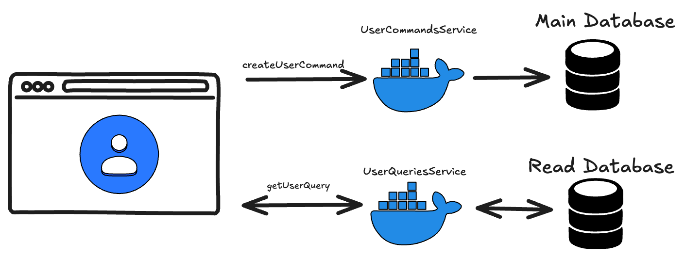

A very important topic in software development is application scaling, which tends to become a headache when maintaining projects.

Among the most common problems are those that show up between the backend server and the database, whether because connections run out, because of data inconsistencies under massive requests, among others. Let's imagine a practical case:

We have a process that holds the database connection for 2 seconds when it runs over the same dataset. Our database only has 10 available connections, but 11 users need to access that process at the same time: the eleventh user won't be able to reach the data because the connections are busy.

As a rule, this situation resolves itself when the eleventh user tries again and one of the previous 10 processes has finished.

But what if we're talking about 100 users? What can go wrong? The server will try to connect to the database 90 times unsuccessfully, which will end up throwing an error: either a connection *timeout* or memory overload, since for each of those attempts it will retry the connection several times if there's a retry system caching the requests.

There are many ways to solve this. One is to introduce a caching system for database requests, so that only the first user makes the request and the next 99 get the cached result back, although this isn't always viable.

Another solution is to set very robust configurations so the server doesn't overwhelm the database, although you'd leave 90 users or more without service, depending on how many are accessing the resource.

In this article we'll tackle the problem with the **CQRS** pattern, which consists of separating read and write operations against the database at the development level.

Ideally you'd even separate the servers, so that one handles read operations and the other write operations, but here we'll look at it together in the example.

The first thing is to answer how this solves the scaling problems mentioned, because it requires a more elaborate strategy than just applying a magic pattern:

- We'll have a **primary** database instance, where all **write** operations run, to avoid data inconsistencies.
- We'll create other **read-only** databases as needed, which will be replicas of the primary and where all **read** operations go.

This way we don't have to scale our primary database vertically forever, and we spread the load by discriminating the operations.

## Code

Our example will have two cases: getting a user's information from a username, and deleting a user. Let's look at getting the information.

First we define our query:

```java
public class GetUserQuery {
    private String username;

    private GetUserQuery(Builder builder) {
        this.username = builder.username;
    }

    public String getUsername() {
        return username;
    }

    public static Builder builder() {
        return new Builder();
    }

    public static class Builder {
        private String username;

        public Builder username(String username) {
            if (username == null || username.isEmpty()) {
                throw new IllegalArgumentException("username cannot be null");
            }
            this.username = username;
            return this;
        }

        public GetUserQuery build() {
            return new GetUserQuery(this);
        }
    }
}
```

We create the controller that will handle user queries:

```java
@RestController
@RequestMapping("/user/queries")
@RequiredArgsConstructor
public class UserQueriesController {
    private final UserQueryHandler queryHandler;

    @GetMapping("{username}")
    public ResponseEntity<User> getUserByUsername(
          @PathVariable String username
    ) {
        GetUserQuery getUserQuery = GetUserQuery.builder()
                .username(username)
                .build();
        User user = queryHandler.handle(getUserQuery);
        return ResponseEntity.ok().body(user);
    }
}
```

We define the handler interface:

```java
public interface UserQueryHandler {
    User handle(GetUserQuery getUserQuery);
}
```

And we implement the interface in our service, handling the logic to look up the user:

```java
@Service
@RequiredArgsConstructor
public class UserService implements UserQueryHandler {
    private final UserRepository userRepository;

    @Override
    public User handle(GetUserQuery query) {
        return userRepository.findById(query.getUsername())
                .map(userEntity -> User.builder()
                        .username(userEntity.username())
                        .email(userEntity.email())
                        .build())
                .orElseThrow(() -> new RuntimeException("User not found"));
    }
}
```

## Conclusion

With this pattern we can separate the read and write operations of our projects, which lets us implement horizontal scaling strategies.

This is because, if our applications receive more read requests than write requests, we can manage different instances and different read databases without having to scale a single database vertically.

Like every solution, it has its pros and cons. We've already covered the benefits; as a downside, we'll have to maintain several databases and several instances (the read and write ones), so we add some complexity to the system.

If you want to follow the project's progress, you can check out the [repository here](https://github.com/nicovegasr/notes-app-microservices).
