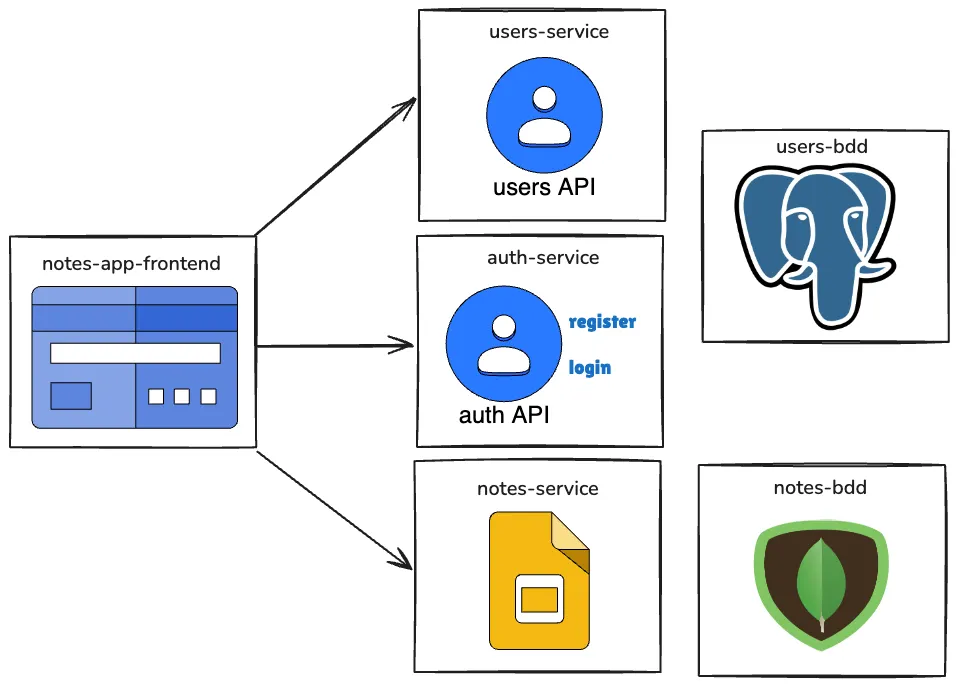

In software development, microservices come up constantly. They bundle together many interesting concepts, and there are two I consider fundamental when facing different problems:

- Using different databases per microservice: relational vs non-relational.
- Communication between microservices.

In this article I focus on the first one.

## Database normalization

To introduce the concept, and since we'll be talking about normalization and denormalization, it's worth knowing what counts as a normalized database.

**Normalized database:** one that satisfies certain normal forms, designed to reduce data redundancy and improve information integrity. The most commonly applied normal form is the Third Normal Form (3NF), which aims to remove transitive dependencies between non-key attributes.

A database in 3NF must meet the following criteria:

- **Be in First Normal Form (1NF):** every column must hold atomic (indivisible) values and there must be no repeating groups.
- **Be in Second Normal Form (2NF):** satisfy 1NF and have every non-key attribute depend fully on the primary key.
- **Have no transitive dependencies:** no non-key attribute should depend on another non-key attribute.

Normalizing to 3NF helps to:

- Reduce data redundancy.
- Minimize update anomalies.
- Make it easier to maintain data integrity.

Later we'll look at the pros and cons of not following these principles and having a denormalized database.

## Using non-relational databases

When considering a non-relational database, the first question that comes up is: why choose this option? While researching the origins of NoSQL databases I found several articles explaining their history and the problems they aim to solve. Two factors stand out as the main motivators: performance and flexibility.

The theory sounds good, but what does it mean in practice? Let's look at one key aspect:

**Data modeling:** instead of establishing relationships through joins (as in relational databases), NoSQL usually goes for denormalizing the data. This means adding keys as direct references between documents or entities, which can significantly improve read performance. Let's see it with an example.

**Case:** we have users in the SQL database and we need to decide how to store their notes. Thinking big, with millions of users hitting our application, this will be the database with the most concurrency, so we'll design it with MongoDB. Below we'll look at two ways to model the data: one denormalizing the data and another thinking of the structure as in SQL.

### Thinking in SQL

If we take an approach similar to a SQL database, we could model users' folders and notes like this:

```java
@Data
@Builder
@Document(collection = "folders")
public class Folder {
    private String folderId;
    private String name;
    private List<Note> notes;  // 1-to-N relationship: a folder contains many notes
}

@Data
@Builder
@Document(collection = "notes")
public class Note {
    private Long noteId;
    private String title;
    private String content;
    private List<Reminder> reminders;  // 1-to-N relationship: a note can have many reminders
    private String createdAt;
    private String updatedAt;
}
```

This design reflects a typical relational approach, where relationships between entities (such as folders and notes) are modeled with foreign keys and nested structures. However, applying it directly in MongoDB has some problems:

- **Size limit:** MongoDB imposes a 16MB limit per document. If a `Folder` document contains a large number of `Notes`, it could hit this limit.
- **Performance:** when loading a `Folder`, MongoDB would have to load all the associated `Notes`, which is inefficient if you only need the `Folder`'s basic information.
- **Updates:** updating a single `Note` within a `Folder` requires updating the whole `Folder` document, which is inefficient and error-prone in high-concurrency applications.

### Thinking in NoSQL

Now, if we model with the characteristics of a NoSQL database like MongoDB in mind, we could design it like this:

```java
@Data
@Builder
@Document(collection = "folders")
public class Folder {
    @Id
    private String folderId;
    private String name;
    private String username;  // Reference to the user who owns the folder
}

@Data
@Builder
@Document(collection = "notes")
public class Note {
    @Id
    private String noteId;
    private String title;
    private String content;
    private String folderId;  // Reference to the Folder it belongs to
    private String username;  // Reference to the user who owns the note
    private String createdAt;
    private String updatedAt;
}
```

In this design we denormalize the data by including `folderId` and `username` directly in the `notes` collection. This approach has several advantages in a NoSQL context:

- **No joins:** MongoDB doesn't support joins natively like SQL, so storing `folderId` and `username` directly in the notes allows efficient queries without joining documents.
- **Scalability and performance:** denormalizing the data and storing it in separate documents (folders and notes) allows faster queries, especially for read-intensive operations.
- **Flexibility:** the model is more flexible, since it lets you modify or scale each entity (folders and notes) independently.

## Conclusion

When designing the database for a notes application in MongoDB, we've explored how NoSQL thinking differs from the traditional SQL approach. Three crucial aspects:

- **Strategic denormalization:** deliberately including redundant data, like `username` across several collections, can significantly improve query performance, though it requires care to keep consistency.
- **Query-oriented modeling:** structuring the data around how it will be queried, not just how it will be stored, is what led us to separate notes from folders into distinct collections.
- **Flexibility vs. consistency:** MongoDB offers great schema flexibility, letting us easily adapt the data model, but it also demands more awareness when handling data consistency.

In the end, the choice between a relational and a NoSQL approach depends on the project's requirements, the data access patterns, and the growth expectations. What matters is understanding the implications of each approach and picking the right tool for the job.

After finishing this microservice, several questions came up. For example: if I delete a user from the authentication database, how do I delete their notes? I'll soon cover how to solve this reliably and consistently, with asynchronous communication between microservices.

If you want to follow the project's progress, you can check out the [repository here](https://github.com/nicovegasr/notes-app-microservices).
