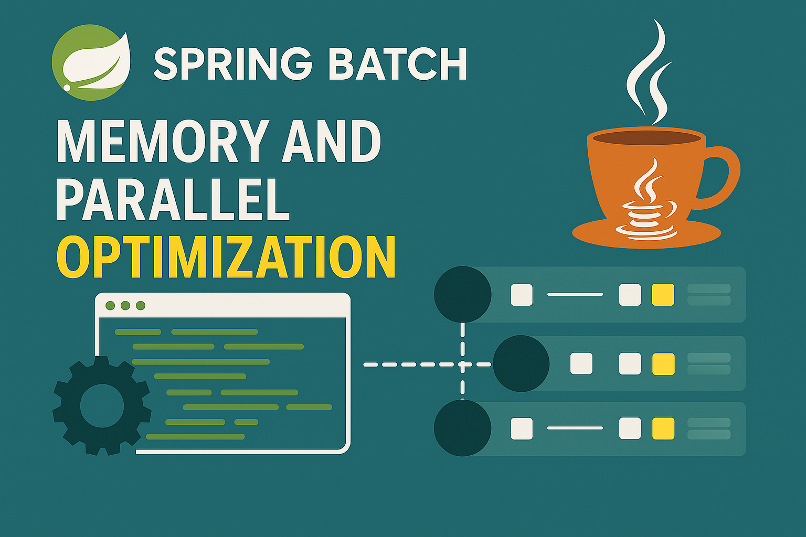
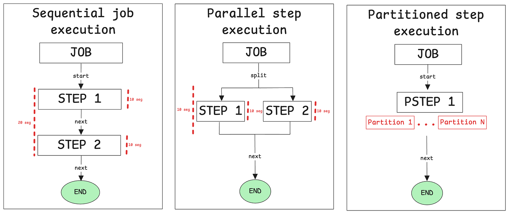

In a previous article I talked about Spring Batch. If you haven't read it and you don't know about Spring Batch, I recommend reading it [here](/en/blog/spring-batch-introduction) first.

In this post we're going to talk about how you can improve performance and scaling in Spring Batch. I'd like to focus on two topics:

- Parallel execution.
- Memory and database considerations to keep in mind when developing a batch app.

## Parallel executions

There are two types of parallel executions in Spring Batch:



- Parallel flow of step executions.
- Partitioning a step.

### Parallel flow of step executions

**Scenario:** we are on the board of directors of FC Barcelona, and in order to improve the team's stats, we need to calculate different KPIs that don't depend on each other. Let's calculate: 🥅 goals, 🎯 passes, 🟥 cards.

```java
@Bean
public TaskExecutor taskExecutor() {
    // Not recommended in production environments
    return new SimpleAsyncTaskExecutor("spring_batch");
}

@Bean
public Job job() {
    return new JobBuilder("job", jobRepository)
            .start(calculateKpisFlow())
            .next(sendEmailStep()).build()
            .build();
}

@Bean
public Flow calculateKpisFlow() {
    return new FlowBuilder<SimpleFlow>("calculateKpisFlow")
            .split(taskExecutor())
            .add(goalsFlow(), passesFlow(), cardsFlow())
            .build();
}

@Bean
public Flow goalsFlow() {
    return new FlowBuilder<SimpleFlow>("goalsFlow")
            .start(goalsStep())
            .build();
}

@Bean
public Step goalsStep() {
    return new StepBuilder("goalsStep", jobRepository)
            .tasklet((contribution, chunkContext) -> {
                System.out.println("Calculating goals...");
                return RepeatStatus.FINISHED;
            }, transactionManager)
            .build();
}

@Bean
public Flow passesFlow() {
    return new FlowBuilder<SimpleFlow>("passesFlow")
            .start(passesStep())
            .build();
}

@Bean
public Step passesStep() {
    return new StepBuilder("passesStep", jobRepository)
            .tasklet((contribution, chunkContext) -> {
                System.out.println("Calculating passes...");
                return RepeatStatus.FINISHED;
            }, transactionManager)
            .build();
}

@Bean
public Flow cardsFlow() {
    return new FlowBuilder<SimpleFlow>("cardsFlow")
            .start(cardsStep())
            .build();
}

@Bean
public Step cardsStep() {
    return new StepBuilder("cardsStep", jobRepository)
            .tasklet((contribution, chunkContext) -> {
                System.out.println("Calculating cards...");
                return RepeatStatus.FINISHED;
            }, transactionManager)
            .build();
}

@Bean
public Step sendEmailStep() {
    return new StepBuilder("sendEmailStep", jobRepository)
            .tasklet((contribution, chunkContext) -> {
                System.out.println("Sending email...");
                return RepeatStatus.FINISHED;
            }, transactionManager)
            .build();
}
```

With this configuration, we are going to execute each flow —`goalsFlow()`, `passesFlow()`, `cardsFlow()`— in parallel. In Java 21+, we can use virtual threads with the task executor by setting the `setVirtualThreads(true)` method.

### Partitioning a step

**Scenario:** we have a large number of passes in our stats, and `passesStep()` is taking too long to execute. We need to partition it to improve performance.

```java
@Bean
public Step passesStep() {
    return new StepBuilder("passesStep", jobRepository)
            .partitioner("passesSlaveStep", passesPartitioner)
            .step(passesSlaveStep())
            .gridSize(3) // Number of partitions for passes
            .taskExecutor(taskExecutor())
            .allowStartIfComplete(true)
            .build();
}

@Bean
public Step passesSlaveStep() {
    return new StepBuilder("passesSlaveStep", jobRepository)
            .tasklet((contribution, chunkContext) -> {
                List<String> passes = (List<String>) chunkContext.getStepContext().getStepExecution()
                        .getExecutionContext().get("passes");

                String stepName = chunkContext.getStepContext().getStepName();

                log.info("In step: " + stepName + ", " + passes.size() + " passes are being processed");

                return RepeatStatus.FINISHED;
            }, transactionManager)
            .allowStartIfComplete(true)
            .build();
}
```

We need to create a `Partitioner` to implement the logic for partitioning the data to be processed by slave workers:

```java
@Component
public class PassesPartitioner implements Partitioner {

    @Override
    public Map<String, ExecutionContext> partition(int gridSize) {
        List<String> passes = Arrays.asList(
                "Short pass - Madrid vs Barcelona",
                "Long pass - Real Sociedad vs Athletic",
                "Through pass - Valencia vs Sevilla",
                "Lateral pass - Atlético vs Villarreal",
                "Filtered pass - Betis vs Osasuna",
                "One-touch pass - Getafe vs Mallorca",
                "Cross pass - Cádiz vs Almería",
                "Lob pass - Girona vs Las Palmas");

        Map<String, ExecutionContext> partitions = new HashMap<>();
        int totalItems = passes.size();
        int itemsPerPartition = (int) Math.ceil((double) totalItems / gridSize);

        for (int i = 0; i < gridSize; i++) {
            int startIndex = i * itemsPerPartition;
            int endIndex = Math.min(startIndex + itemsPerPartition, totalItems);

            if (startIndex < totalItems) {
                ExecutionContext context = new ExecutionContext();
                List<String> partitionPasses = new ArrayList<>(passes.subList(startIndex, endIndex));

                context.put("passes", partitionPasses);
                partitions.put("partition" + i, context);
            }
        }
        return partitions;
    }
}
```

Now we can check our logs and see how this step is being executed in parallel:

```text
2025-06-05T01:06:31.589+01:00  INFO 70998 --- [demo] [  spring_batch3] o.s.batch.core.job.SimpleStepHandler     : Executing step: [cardsStep]
2025-06-05T01:06:31.589+01:00  INFO 70998 --- [demo] [  spring_batch2] o.s.batch.core.job.SimpleStepHandler     : Executing step: [passesStep]
Calculating cards...
2025-06-05T01:06:31.597+01:00  INFO 70998 --- [demo] [  spring_batch3] o.s.batch.core.step.AbstractStep         : Step: [cardsStep] executed in 7ms
2025-06-05T01:06:31.608+01:00  INFO 70998 --- [demo] [  spring_batch5] com.example.demo.jobs.DemoJob            : In step: passesSlaveStep:partition2, 2 passes are being processed
2025-06-05T01:06:31.608+01:00  INFO 70998 --- [demo] [  spring_batch4] com.example.demo.jobs.DemoJob            : In step: passesSlaveStep:partition0, 3 passes are being processed
2025-06-05T01:06:31.609+01:00  INFO 70998 --- [demo] [  spring_batch6] com.example.demo.jobs.DemoJob            : In step: passesSlaveStep:partition1, 3 passes are being processed
2025-06-05T01:06:31.610+01:00  INFO 70998 --- [demo] [  spring_batch5] o.s.batch.core.step.AbstractStep         : Step: [passesSlaveStep:partition2] executed in 4ms
2025-06-05T01:06:31.611+01:00  INFO 70998 --- [demo] [  spring_batch4] o.s.batch.core.step.AbstractStep         : Step: [passesSlaveStep:partition0] executed in 4ms
2025-06-05T01:06:31.612+01:00  INFO 70998 --- [demo] [  spring_batch6] o.s.batch.core.step.AbstractStep         : Step: [passesSlaveStep:partition1] executed in 5ms
2025-06-05T01:06:31.615+01:00  INFO 70998 --- [demo] [  spring_batch2] o.s.batch.core.step.AbstractStep         : Step: [passesStep] executed in 25ms
```

## Memory & database

Alright, now we know how to optimize Spring Batch apps, but there's always a bottleneck to deal with —especially when it comes to counting operations: the **database**.

Knowing this, we have to be very precise with our configurations and code to achieve good performance and prevent memory-related issues in our application, such as running out of heap space and causing the application to crash.

### Heap memory

When you're developing a data-oriented app, you have to take into account how much data you're going to process. If you have 1 million records and you do something like this:

```java
List<Object> oneMillionObjects = readOneMillionObjects();
List<Object> oneMillionObjectsProcessed = processThis(oneMillionObjects);
```

Now you have 2 million objects in your heap. Let's say your object looks like this:

```java
public record Object(
    long id,              // 8 bytes
    String name,          // 4 + 12 + 4 + 4 + 1 + 1 + string size bytes = 26+ bytes
    String description    // 4 + 12 + 4 + 4 + 1 + 1 + string size bytes = 26+ bytes
) { }
```

Breakdown of memory usage per field. In Java, each `String` object has:

- String header: ~12 bytes
- Reference to `byte[]`: 4 bytes
- Hash: 4 bytes
- Coder (Java 9+): 1 byte
- Padding: 1 byte

Now:

- `long` is a primitive: 8 bytes
- `String` is an object: ~22 bytes + the actual string size
- Don't forget the object instance itself adds ~22 bytes

So, for an object like `new Object(1L, "John Doe", "Example text description to this object")`, you're roughly using 168 bytes per instance. If you have 1 million of these: 1M × 168 bytes = ~160 MB. With two lists (original + processed), you're holding ~320 MB in heap memory — without any real need for it.

**Best practice for batch apps:** in batch applications we need to be aware of these situations and process items without keeping them in memory. If we can use primitives or avoid unnecessary collections, even better:

```java
readOneMillionObjects().stream().forEach(object -> {
    processThis(object);
});
```

And that's it. You could even use `parallelStream()` to speed things up — but be careful: your `processThis()` method must be thread-safe, or you'll run into concurrency issues like race conditions or fork errors.

### Database

Another important thing you have to take into account is the connection pool to the database. To ensure the efficiency of the data processing we have to apply specific configuration depending on the size of the data flow we are going to handle.

I strongly recommend reading the HikariCP properties in the HikariCP repository documentation. But if you don't want to, here's the summary:

Even if you configure `maximumPoolSize` to 5000, your app is likely going to be slower than if you set it to 100. Why? Because of basic computer science principles.

If you have 12 processors and try to run 5000 threads in parallel, each processor ends up managing around 416 threads. This is how it works:

```text
processor: 1

START       THREAD 1
PAUSE       THREAD 1
START       THREAD 2
PAUSE       THREAD 2
CONTINUE    THREAD 1
PAUSE       THREAD 1
START       THREAD 3
PAUSE       THREAD 3
START       THREAD 4
PAUSE       THREAD 4
```

All that context switching (starting, pausing, resuming threads) introduces overhead and makes the system slower. In many cases, it's actually faster to run fewer tasks sequentially than to overload the system with thousands of threads that just spend time waiting for CPU time.

### ORM vs native SQL

Besides, when we write SQL queries or JPA methods, we need to optimize each query to achieve better performance. It really depends on your priorities:

- The convenience and abstraction of JPA, or
- The raw performance of native SQL queries.

Sometimes, if you're handling a large volume of data, JPA is simply not a valid choice — it may not be able to guarantee the minimum level of speed required. Also, remember not to overcomplicate your queries; it's better to have small, atomic steps than massive, unmaintainable queries.

In those cases, native queries give you more control and often result in significantly better performance.

I hope this advice helps you develop an efficient and robust application with Spring Batch. Feel free to dig deeper into the documentation and experiment with different configurations — that's the best way to truly understand how it behaves in real scenarios. Good luck and happy coding!
