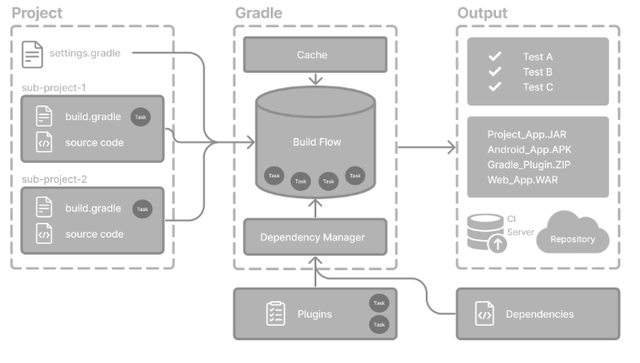

En el ecosistema J2EE es habitual usar Maven o Gradle para automatizar el proceso de build. A veces damos por hecho que estas herramientas son magia y que solo hay que ejecutar un comando como `gradlew clean build`, pero ¿cómo funcionan y qué podemos hacer realmente con ellas?

Maven y Gradle son herramientas de automatización de builds: compilan código, empaquetan aplicaciones, gestionan dependencias y ejecutan las clases de test.

Maven está basado en XML, mientras que Gradle se apoya en un DSL conciso escrito en Groovy o Kotlin y es más reciente que Maven. A pesar de sus diferencias, ambos pueden realizar prácticamente las mismas tareas. Sin embargo, al ser más nuevo, Gradle ofrece mayor flexibilidad y potencia; características como los builds incrementales y la configuración perezosa (*lazy*) pueden ahorrar minutos en proyectos grandes.

## Gradle entre bastidores

Gradle usa dos directorios principales para realizar y gestionar su trabajo:

- **Directorio home de usuario de Gradle:** almacena las propiedades de configuración global, los scripts de inicialización, las cachés y los ficheros de log.
- **Directorio raíz del proyecto:** contiene todos los ficheros fuente de tu proyecto, junto con los directorios que Gradle genera —como `.gradle` y `build`.

A veces una dependencia cacheada puede dar problemas o no actualizarse como esperabas. En la sección [Gradle-managed directories](https://docs.gradle.org/current/userguide/directory_layout.html) puedes ver configuraciones de caché habituales y encontrar algunos consejos.



Hay unos cuantos conceptos clave que necesitas conocer para trabajar con Gradle:

- **Projects** — una pieza de software que se puede construir (aplicación / librería).
- **Build scripts** — indican a Gradle qué pasos seguir para construir el proyecto.
- **Dependencias y gestión de dependencias** — una técnica automatizada para declarar y resolver los recursos externos que requiere un proyecto.
- **Tasks** — la unidad básica de trabajo, como compilar código o ejecutar los tests. Cada proyecto contiene una o más tasks definidas dentro de un build script o un plugin.
- **Plugins** — los plugins amplían las capacidades de Gradle.

Teniendo todo esto en cuenta, también es importante entender el ciclo de vida del build para poder depurar cualquier comportamiento inesperado en tu proyecto:

1. **Inicialización** — Gradle ejecuta `settings.gradle(.kts)` para determinar qué proyectos se construirán y crea un objeto `Project` para cada uno.
2. **Configuración** — Gradle configura cada proyecto ejecutando los ficheros `build.gradle(.kts)` correspondientes. Durante esta fase resuelve las dependencias y construye un grafo de ejecución de tasks que contiene solo las tasks necesarias para el build solicitado.
3. **Ejecución** — Gradle ejecuta las tasks especificadas en la línea de comandos, junto con las tasks prerrequisito de las que depende su grafo.

## Ficheros habituales de Gradle

### gradle.properties

Las propiedades de Gradle, de sistema y de proyecto se encuentran en el fichero `gradle.properties`; algunas props (como `springBootVersion`) las recogen los plugins, y el resto son valores propios que otros scripts reutilizarán más adelante.

```properties
# Gradle properties
org.gradle.parallel=true
org.gradle.caching=true
org.gradle.jvmargs=-Duser.language=en -Duser.country=US -Dfile.encoding=UTF-8

# System properties
systemProp.pts.enabled=true
systemProp.log4j2.disableJmx=true
systemProp.file.encoding=UTF-8

# Project properties
kotlin.code.style=official
android.nonTransitiveRClass=false
spring-boot.version=2.2.1.RELEASE
```

### settings.gradle

Define la estructura del build, como qué proyectos se incluyen. Sin un fichero de settings, Gradle trata el build como un build de proyecto único por defecto.

```groovy
rootProject.name = 'root-project'

include('sub-project-a')
include('sub-project-b')
include('sub-project-c')
```

### build.gradle

Un fichero `build.gradle` es la receta de tu proyecto para Gradle: le indica a la herramienta qué plugins aplicar, qué dependencias descargar y qué tasks y ajustes ejecutar cuando dices `gradle build`.

```groovy
plugins {
  id 'java'
}

allprojects {
    group = 'com.example'
    version = '1.0.0'

    repositories {
        mavenCentral()
    }

    tasks.register('helloWorld') {
        doLast {
            println 'Hola Mundo desde Gradle!'
        }
    }
}

subprojects {
    apply plugin: 'java'

    java {
        toolchain {
            languageVersion = JavaLanguageVersion.of(17)
        }
    }

    dependencies {
        implementation "org.jetbrains.kotlin:kotlin-stdlib:${kotlinVersion}"
        testImplementation 'junit:junit:4.13.2'
    }

    tasks.withType(JavaCompile) {
        options.encoding = 'UTF-8'
    }
}
```

- **Plugins:** en esta sección listamos los plugins de Gradle que necesitamos.
- **allprojects:** el bloque `allprojects {}` aplica la misma configuración a todos los módulos del build. Si solo tienes un módulo, puedes omitirlo — no hace daño, simplemente no aporta valor.
- **subprojects:** el bloque `subprojects {}` es como `allprojects`, pero apunta solo a los módulos hijos y deja en paz al proyecto raíz.

Ahora analicemos cada parte concreta:

**Repositories:** dentro del bloque `repositories {}` le decimos a Gradle dónde buscar las dependencias — p. ej. `mavenCentral()`, `google()` o un repositorio Maven privado.

```groovy
mavenCentral()
maven {
    url = uri("https://company/com/maven2")
}
mavenLocal()
flatDir {
    dirs "libs"
}
```

**Dependencies:** dentro del bloque `dependencies {}` declaramos lo que nuestro código (u otros módulos) necesita. Las configuraciones más usadas tienen este aspecto:

```groovy
implementation project(":myProject")
compileOnly project(":myProject")
runtimeOnly project(":myProject")
testImplementation project(":myProject")
```

**Tasks:** las tasks de Gradle se dividen en dos grupos:

- **Tasks accionables** tienen una o varias acciones asociadas para hacer trabajo en tu build: `compileJava`.
- **Tasks de ciclo de vida** son tasks sin acciones asociadas: `assemble`, `build`.

Normalmente, una task de ciclo de vida depende de muchas tasks accionables y se usa para ejecutar muchas tasks a la vez.

## Propiedades útiles de Gradle

```properties
org.gradle.jvmargs=-Xmx3200m -XX:MaxMetaspaceSize=768m -XX:+HeapDumpOnOutOfMemoryError -Dfile.encoding=UTF-8
org.gradle.parallel=true
org.gradle.caching=true
org.gradle.configuration-cache=true
org.gradle.configuration-cache.parallel=true
org.gradle.configuration-cache.entries-per-key=2
```

1. Establece los argumentos de la JVM (Java Virtual Machine) para el daemon de Gradle.
2. Habilita la ejecución en paralelo de tasks. Gradle intentará ejecutar a la vez las tasks que no dependen entre sí, lo que puede acelerar los builds en máquinas multinúcleo.
3. Habilita la build cache, que almacena las salidas de builds anteriores y las reutiliza cuando es posible, reduciendo el tiempo de build al evitar trabajo innecesario.
4. Habilita la configuration cache, que cachea el resultado de la fase de configuración. Esto puede mejorar mucho el tiempo de arranque del build al saltarse la configuración cuando nada ha cambiado.
5. Permite la configuración en paralelo de los builds incluidos al usar la configuration cache. Esto puede reducir aún más el tiempo de configuración en setups multi-build.
6. Controla cuántas entradas de caché se guardan por clave única en la configuration cache. Ponerlo a 2 significa que Gradle mantendrá hasta 2 configuraciones cacheadas distintas por cada conjunto único de entradas.

## Arquitectura con Gradle

Como arquitecto de software puedes hacer múltiples cosas con Gradle — desde configurar un proyecto Gradle simple, montar un build multiproyecto, hasta diseñar una arquitectura hexagonal con acceso restrictivo entre capas (infraestructura, aplicación y dominio).

- **Los builds de proyecto único** incluyen un solo proyecto llamado proyecto raíz.
- **Los builds multiproyecto** incluyen un proyecto raíz y cualquier número de subproyectos.

La documentación de Gradle ya cubre los setups de proyecto único y multiproyecto, así que aquí me centraré en cómo usarlos para montar un proyecto de arquitectura hexagonal.

Si tenemos una estructura de proyecto como esta:

```text
hexagonal-project
├── settings.gradle(.kts)
├── gradle.properties
├── build.gradle(.kts)
├── infrastructure
│   ├── infrastructure.gradle(.kts)
│   └── src
├── application
│   ├── application.gradle(.kts)
│   └── src
└── domain
    ├── domain.gradle(.kts)
    └── src
```

Nuestro `settings.gradle` debería ser algo así:

```groovy
rootProject.name = "hexagonal-project"

include 'infrastructure', 'application', 'domain'

project(":infrastructure").buildFileName = "infrastructure.gradle"
project(":application").buildFileName = "application.gradle"
project(":domain").buildFileName = "domain.gradle"
```

En la capa de infraestructura podemos ocultar la API del dominio de los imports directos: cada adaptador se comunica únicamente a través de los contratos/puertos declarados en la capa de aplicación. Así, los classpaths de compilación mantienen intactos los límites hexagonales.

```groovy
// infrastructure.gradle
dependencies {
    implementation project(":application")
    runtimeOnly project(":domain")
}

// application.gradle
dependencies {
    implementation project(":domain")
}
```

Cuando pensamos en implementar *vertical slices*, esta característica se vuelve aún más potente, ya que podemos separar nuestros componentes de infraestructura (base de datos, red, adaptadores de servicios de terceros) y limitar la comunicación entre ellos. De esta forma, si un adaptador —por ejemplo, un adaptador de Spring— necesita acceder a un adaptador de persistencia, se ve obligado a comunicarse a través de nuestro dominio, evitando violaciones de los principios de la arquitectura hexagonal dentro de nuestro equipo de desarrollo.

## Conclusión

Este artículo cubre solo una pequeña parte de los muchos usos de Gradle. Gradle ofrece una gran cantidad de características y plugins —por ejemplo, publicar artefactos en repositorios privados como Nexus para compartir librerías comunes, ejecutar tasks en paralelo en builds multiproyecto, lanzar builds continuos que reejecutan tus tests cada vez que cambia un fichero, y mucho más.

¡Gracias por leer, y espero que esta visión general te haya resultado útil!
