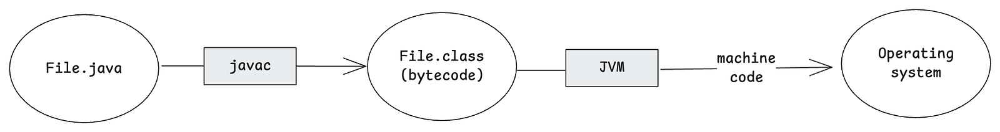
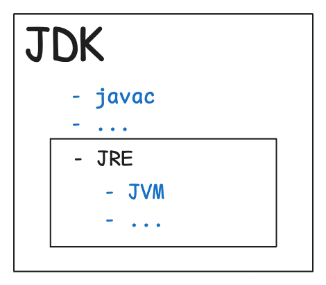
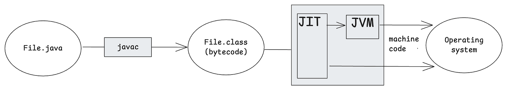

En el mundo del desarrollo de software muchas veces vamos tan rápido que olvidamos los fundamentos de un sistema de información.

En mis tiempos de universidad me preguntaba constantemente: ¿por qué necesito entender cómo funcionan las cosas a bajo nivel? ¿Qué sentido tiene aprender conceptos como la memoria, la ejecución de instrucciones en una ALU o cómo funciona el lenguaje ensamblador?

Hoy, como profesional del sector, veo claramente las ventajas de entender en profundidad cómo se comportan los sistemas. Si tuviera que resumirlo en una palabra sería: optimización. Y optimizar procesos también significa reducir costes.

En resumen: optimización = menos hardware / escalado vertical = ahorro en la infraestructura de tu organización.

Hoy muchas empresas se apoyan en el ecosistema Spring con Java, y su popularidad no para de crecer por lo fácil que hace desarrollar herramientas empresariales robustas. Sin embargo, cuando trabajamos con aplicaciones que manejan grandes volúmenes de datos, la eficiencia del software se vuelve crítica.

Para entender cómo optimizar Java es esencial entender primero cómo funcionan las aplicaciones Java dentro de nuestros sistemas, cómo interactúan con el sistema para realizar tareas y cómo podemos adoptar estrategias para simplificar tanto el proceso de compilación como una gestión eficiente de la memoria.

## ¿Qué es Java?

Java es un lenguaje de programación diseñado como solución para manejar procesos informáticos complejos usando un lenguaje de alto nivel, más cercano al lenguaje humano.

Esto significa que, como cualquier lenguaje de programación de alto nivel, Java debe traducirse al conjunto de instrucciones del sistema operativo para realizar sus funciones. Aquí es donde entra en juego el compilador de Java.

Cuando decimos que Java es multiplataforma, esta es la razón:

- El programador escribe un fichero `.java`.
- El compilador `javac`, incluido en el JDK de Java, traduce el código a bytecode (ficheros `.class`).
- La JVM (Java Virtual Machine), también parte del JDK, traduce los ficheros `.class` a código máquina específico del sistema operativo.
- El sistema operativo interpreta ese código y ejecuta las tareas correspondientes.

En resumen, existen distintas versiones del JDK para cada sistema operativo y para arquitecturas de procesador concretas.

Con esto en mente, podríamos decir que para desarrollar una aplicación Java realmente solo necesitas un editor de texto y el JDK correcto para tu sistema operativo. Sin embargo, al hablar de Java suelen aparecer estos conceptos: JDK, JRE, JVM. ¿Qué significan realmente y cómo se relacionan?

## JDK, JRE y JVM

Visualmente, imaginemos que Java empezó siendo solo un lenguaje con su compilador, parecido a C++, pero con una gran diferencia: la incorporación de la JVM, que traduce el bytecode a lenguaje máquina. El proceso se vería así:



Hasta aquí hemos aprendido algunas cosas clave sobre Java:

- Su naturaleza multiplataforma viene de que Java se "compila" dos veces: primero a bytecode y después a código máquina según el sistema operativo donde se ejecute.
- La JVM (Java Virtual Machine) se encarga de interpretar ese bytecode, pero también gestiona muchas otras tareas (que exploraremos más adelante).
- El ecosistema de Java incluye herramientas que varían según el sistema operativo donde corre la aplicación.

Con esto en mente se creó el JDK (Java Development Kit): un conjunto de herramientas y programas desarrollados por el equipo de Java para facilitar el desarrollo y la ejecución de programas Java. Es importante recalcar que el JDK está orientado principalmente al desarrollo de aplicaciones.

Sin embargo, en entornos de producción a menudo solo queremos ejecutar aplicaciones, no desarrollarlas. El JDK incluye muchas funcionalidades que no se necesitan para una simple ejecución. Aquí es donde entra el JRE (Java Runtime Environment): un paquete que aporta todo lo necesario para ejecutar una aplicación Java sin las herramientas de desarrollo adicionales.

Un diagrama global se vería así:



### Resumen rápido

Ahora que entendemos qué hace cada componente, aquí tienes un resumen rápido que puedes usar al explicarlos:

- **JDK (Java Development Kit):** un kit de herramientas que te permite no solo ejecutar, sino también desarrollar programas Java en entornos como los IDE.
- **JRE (Java Runtime Environment):** incluye todo lo necesario para únicamente ejecutar aplicaciones Java ya compiladas.
- **JVM (Java Virtual Machine):** la máquina virtual que traduce el bytecode generado por el compilador de Java a instrucciones que el sistema operativo puede entender y ejecutar.

### JIT (Just-In-Time compilation)

Otra característica interesante que podemos añadir a nuestro diagrama es el JIT (Just-In-Time compilation). Este proceso mejora la velocidad de ejecución de la JVM y funciona así:



Cuando ejecutamos un fichero `.java`, algunas partes del código se denominan "hot code" (código caliente). Se refiere a código que se ejecuta repetidamente. La JVM detecta estas secciones de ejecución frecuente y las compila en tiempo de ejecución para evitar interpretarlas cada vez. Este proceso se conoce como JIT (Just-In-Time compilation).

```java
public class Example {
    public static void main(String[] args) {
        for (int i = 0; i < 1000; i++) {
            helloWorld();
        }
    }

    public static void helloWorld() {
        System.out.println("Hello world");
    }
}
```

En la primera ejecución del bucle `for`, el método `helloWorld()` se interpreta de forma normal. La JVM reconocerá entonces que esta función se ejecuta muy frecuentemente (convirtiéndola en "hot code") y la compilará en tiempo de ejecución mediante JIT, mejorando el rendimiento de las siguientes llamadas.

## La memoria en Java

Como mencionamos antes, la clave de la optimización es entender los fundamentos. En Java, la memoria se divide en dos áreas principales:

- **Heap:** almacena objetos y arrays; lo gestiona el Garbage Collector.
- **Stack:** la pila de ejecución donde se almacenan variables locales, referencias y llamadas a métodos. Cada hilo tiene su propia pila, que se limpia cuando el método termina.

Al ejecutar aplicaciones Java puedes establecer límites de memoria con parámetros como:

```bash
java -Xms512m -Xmx2g -Xss1m -jar example.jar
```

- `-Xms` → tamaño inicial del heap (p. ej. `-Xms512m` → 512 MB).
- `-Xmx` → tamaño máximo del heap (p. ej. `-Xmx2g` → 2 GB).
- `-Xss` → tamaño del stack por hilo (p. ej. `-Xss1m` → 1 MB).

Aquí tienes un ejemplo sencillo de cómo se asigna la memoria en Java:

```java
public class Example {
    public static void main(String[] args) {
        int posX = 1;          // -----------------------------> STACK
        int posY = 2;          // -----------------------------> STACK
        Object coordinate = new Object(posX, posY); // --------> HEAP
    }
}
```

La conclusión es que el área de memoria a vigilar más de cerca es el Heap, ya que una mala gestión puede afectar gravemente al rendimiento. Aquí es donde el Garbage Collector de Java juega un papel crítico.

## Garbage Collector

En Java pueden aparecer problemas de rendimiento cuando el Heap es insuficiente. Por lo general, esto indica una mala gestión de la memoria. Repasemos los errores de memoria más comunes y los garbage collectors disponibles en Java.

### Errores de memoria comunes

- **Java heap space:** no hay memoria suficiente para asignar otro objeto en el heap.
- **GC overhead limit exceeded:** el Garbage Collector intentó liberar memoria varias veces sin éxito y el heap sigue teniendo menos del 2 % de espacio libre.
- **Metaspace:** no hay memoria suficiente para almacenar los metadatos de las clases.

**Consideración:** cuando el Garbage Collector se ejecuta, Java pausa la ejecución de la aplicación, lo que puede reducir la eficiencia.

### Tipos de garbage collector

- **Serial GC** (`-XX:+UseSerialGC`): sencillo y más antiguo; usa un único hilo. Mejor para aplicaciones pequeñas o embebidas. Provoca pausas largas, ya que detiene toda la aplicación.
- **Parallel GC** (`-XX:+UseParallelGC`): usa varios hilos para reducir los tiempos de pausa.
- **G1 GC** (`-XX:+UseG1GC`): el predeterminado desde Java 9; divide el heap en regiones, recolecta en paralelo y ofrece pausas cortas y predecibles. Ideal para aplicaciones grandes con requisitos de baja latencia.
- **ZGC** (`-XX:+UseZGC`): introducido en Java 11; diseñado para latencia ultrabaja y heaps enormes (varios terabytes), con pausas inferiores a 10 ms.
- **Shenandoah** (`-XX:+UseShenandoahGC`): desarrollado por Red Hat e incluido oficialmente desde Java 12; ofrece pausas extremadamente cortas, independientes del tamaño del heap.

Ahora que tenemos una idea más clara, podemos experimentar con distintas estrategias en nuestros proyectos y elegir la que mejor se ajuste a nuestras necesidades.

Para mejorar la gestión de memoria en aplicaciones Java, plantéate usar tipos primitivos en lugar de clases wrapper siempre que sea posible, ya que los primitivos consumen menos memoria y evitan la creación innecesaria de objetos. Además, reutiliza objetos en vez de crear nuevos repetidamente, y cierra recursos como streams y conexiones cuanto antes para prevenir fugas de memoria.

## Conclusión

A lo largo de este recorrido hemos visto que entender cómo funciona Java a bajo nivel no es solo una curiosidad académica: es una habilidad clave para mejorar el rendimiento y optimizar recursos.

Conocer conceptos como la JVM, el JDK, el JRE, el Garbage Collector y el JIT nos permite tomar mejores decisiones de diseño y ejecución en nuestros proyectos. Ser conscientes de cómo se gestiona la memoria y de cómo afinar sus parámetros también nos da mayor control para prevenir problemas de rendimiento o caídas inesperadas.

En resumen, dominar estas áreas no solo hace nuestro software más eficiente, sino que también ayuda a reducir costes y mejorar la experiencia de usuario.

La optimización siempre empieza por entender los fundamentos.
