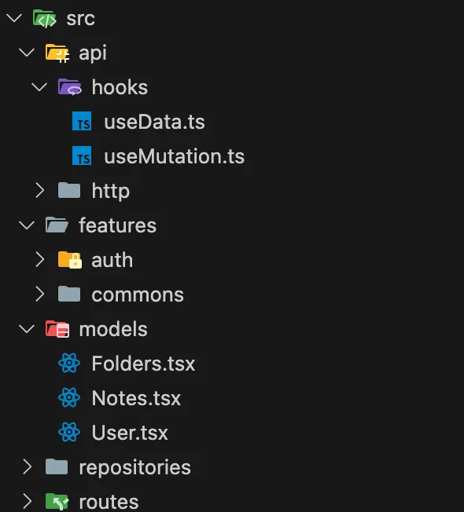

Personalmente considero que la arquitectura en el frontend es algo bastante complicado. Desde mi experiencia personal en proyectos con React, la estructura de ficheros suele escalar bastante rápido y, sin darte cuenta, ya es todo un reto navegar por el proyecto.

Desde mi punto de vista hay 3 factores clave a la hora de desarrollar soluciones frontend que debemos tener en cuenta:

- Eliminar renderizados innecesarios evitando añadir `useEffect`s y abusar del prop drilling.
- Manejo correcto de la red para evitar llamadas innecesarias al backend.
- Navegación eficiente por la estructura de ficheros.

Algunas de las reflexiones a las que llegué y que considero más interesantes:

## Estandarizar la arquitectura del proyecto

La idea de esta arquitectura es separar lo máximo posible la lógica de la aplicación —como las llamadas HTTP y los modelos— de la parte visual de las páginas y componentes.



En caso de que la aplicación crezca considerablemente podemos separar nuestros modelos por bounded context, aunque me decanto más por la idea de mantener los modelos separados de las features para tener una clara diferencia entre el modelado de datos de nuestra aplicación y la parte visual.

## Desacoplar las llamadas HTTP

Una forma bastante interesante de crear un solo tipo de llamada HTTP (POST, DELETE, GET, PATCH, PUT) es envolver tus llamadas con tipos genéricos. Esto nos permite una mayor versatilidad si decidimos cambiar de librería. Podemos ver un ejemplo a continuación de cómo hacerlo con axios y con fetch:

Con axios:

```ts
import axios, { AxiosRequestHeaders } from 'axios';

type Headers = AxiosRequestHeaders;

const get = async <T>(url: string, headers?: Headers): Promise<T> => {
  const response = await axios.get<T>(url, { headers });
  return response.data;
};

const post = async <T, K>(url: string, body: K, headers?: Headers): Promise<T> => {
  const response = await axios.post<T>(url, body, {
    headers: {
      ...headers,
      Accept: 'application/json',
      'Content-Type': 'application/json',
    },
  });
  return response.data;
};

export const http = {
  get,
  post,
};
```

Con fetch:

```ts
type Headers = { [key: string]: string };

const get = async <T>(url: string, headers?: Headers) => {
  const response = await fetch(`${url}`, {
    method: 'GET',
    headers: { ...headers },
  });
  return (await response.json()) as T;
};

const post = async <T, K>(url: string, body: K, headers?: Headers) => {
  const response = await fetch(`${url}`, {
    method: 'POST',
    headers: {
      ...headers,
      Accept: 'application/json',
      'Content-Type': 'application/json',
    },
    body: JSON.stringify(body),
  });
  return (await response.json()) as T;
};

export const http = {
  get,
  post,
};
```

Además, contribuye a que el proyecto tenga solo una definición de petición, por lo que a priori no tendremos múltiples ficheros con cantidades exageradas de peticiones.

Con esta definición de llamadas podemos crear un repositorio por cada uno de los escenarios que necesitemos y así tendremos todo más organizado.

## Desacoplar tanstack/react-query

Para aquellos que no conocen la librería, react-query nos permite cachear las llamadas HTTP que realizamos para que el manejo de dichos datos sea más eficiente, y nos proporciona muchas facilidades para trabajar con datos asíncronos en nuestra aplicación.

Cuando utilizamos esta librería también somos propensos a terminar creando múltiples ficheros donde cada uno tenga un `useQuery` y/o un `useMutation`. Si en alguna versión la librería cambia la estructura de comunicación con su API, tendríamos que cambiar en cada uno de esos archivos la forma en la que declaramos esas funciones.

Para evitar este problema, podemos crearnos nuestros propios hooks:

```ts
import { useQuery } from '@tanstack/react-query';

type Status = 'pending' | 'error' | 'success';

interface UseData<T> {
  key: string;
  fetcher: () => Promise<T>;
}

interface Response<T> {
  data: T | undefined;
  status: Status;
}

export const useData = <T>({ key, fetcher }: UseData<T>): Response<T> => {
  const { data, status } = useQuery<T, string>({ queryKey: [key], queryFn: fetcher });
  return { data, status };
};
```

```ts
import { useMutation, useQueryClient } from '@tanstack/react-query';

interface UseDataMutation<T> {
  key: string;
  mutation: (data: T) => Promise<T>;
}

export const useDataMutation = <T>({ key, mutation }: UseDataMutation<T>) => {
  const { mutateAsync: reactQueryMutate, status, data } = useMutation({
    mutationFn: (data: T) => mutation(data),
  });
  const queryClient = useQueryClient();

  const mutate = async (data: T) => {
    await Promise.all([
      reactQueryMutate(data),
      queryClient.invalidateQueries({ queryKey: [key] }),
    ]);
  };

  return { mutate, status, data };
};
```

En base a nuestras necesidades podemos añadir campos a nuestros hooks para especificárselos a las opciones de `useQuery` o `useMutation`, y podemos retornar también lo que nos interese.

## Centralizar queries

Por último, para centralizar las llamadas al backend me parece curioso aplicar el patrón repository en el frontend. El resultado sería el siguiente:

```ts
const AuthRepository = () => {
  const baseUrl = 'http://localhost:8082';

  const {
    mutate: loginMutate,
    status: loginStatus,
    data: loginData,
  } = useDataMutation<User>({
    key: 'login',
    mutation: (user: User) => http.post<User, User>(baseUrl + '/api/v1/auth/login', user),
  });

  const {
    mutate: registerMutate,
    status: registerStatus,
    data: registerData,
  } = useDataMutation<User>({
    key: 'register',
    mutation: (user: User) => http.post<User, User>(baseUrl + '/api/v1/auth/register', user),
  });

  const loginUser = async (user: User) => {
    return await loginMutate(user);
  };

  const registerUser = async (user: User) => {
    return await registerMutate(user);
  };

  return {
    login: loginUser,
    loginResponse: { status: loginStatus, data: loginData },
    register: registerUser,
    registerResponse: { status: registerStatus, data: registerData },
  };
};

export default AuthRepository;
```

Con todo esto, nuestro componente de registro quedaría así:

```tsx
export const Register = () => {
  const { register } = AuthRepository();
  const toast = useToast();

  const registerUser = async (user: User) => {
    register(user)
      .then(() => {
        toast.add('User registered successfully', 'success');
      })
      .catch((error) => {
        const message = (error.response?.data as string) || 'Network error';
        toast.add(message, 'error');
      });
  };

  return (
    <div className="h-full w-full flex flex-col items-center justify-center">
      <div className="bg-white p-8 w-4/5 md:w-1/2 lg:w-1/3 flex flex-col items-center justify-center space-y-6 shadow-lg rounded-lg animate-fadeIn">
        <div className="flex items-center justify-center p-4 w-full h-20 animate-fadeIn">
          <Image src="icons/user.png" alt="Note icon" width={50} height={50} />
          <h1 className="text-5xl font-bold ml-4">Register</h1>
        </div>
        <UserForm mode="register" onSend={registerUser} />
        <Link href="/login"> Already have an account? Login </Link>
      </div>
    </div>
  );
};
```

¡Muchas gracias por leer hasta aquí! Cualquier feedback es bien recibido. Si quieres ver el progreso del proyecto, puedes acceder al [repositorio aquí](https://github.com/nicovegasr/notes-app-microservices).
