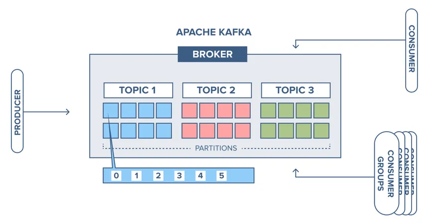
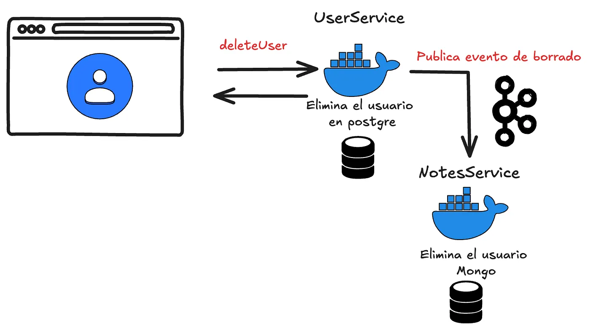

El mundo de la programación orientada a eventos me resulta un tema muy interesante: te permite tener una trazabilidad robusta de las operaciones y un sistema considerablemente resiliente a fallos.

En este artículo veremos cómo integrar Kafka en un proyecto de Spring e introduciremos brevemente para qué se usa la herramienta y la justificación parcial de su uso en este proyecto.

## Introducción a Kafka

Para tener una idea general de Kafka, es una solución robusta a la necesidad de un sistema de eventos. En términos generales es necesario entender los siguientes tres conceptos principales:

- **Consumer:** nodo que consume eventos.
- **Producer:** nodo que publica eventos.
- **Topic:** categoría o canal en el que se agrupan los eventos publicados.



A nivel teórico es bastante interesante toda la infraestructura de Kafka y cómo logran que la solución sea tan escalable y robusta, pero, a modo de resumen, lo usaremos para comunicaciones asíncronas en nuestra aplicación: de esta forma reduciremos latencia y tendremos tolerancia a fallos, ya que si falla la parte de nuestra aplicación que depende de Kafka, este se encargará de volver a intentar resolver el evento fallido.

## Iniciar un servidor de Apache Kafka

Lo primero que tenemos que hacer es tener un servidor de Kafka, así que usaremos Docker Compose para generar el nuestro:

```yaml
services:
  zookeeper:
    image: confluentinc/cp-zookeeper:latest
    container_name: zookeeper
    environment:
      ZOOKEEPER_CLIENT_PORT: 2181
      ZOOKEEPER_TICK_TIME: 2000
    ports:
      - "2181:2181"

  kafka:
    image: confluentinc/cp-kafka:latest
    container_name: kafka
    ports:
      - "9092:9092"
    environment:
      KAFKA_BROKER_ID: 1
      KAFKA_ZOOKEEPER_CONNECT: zookeeper:2181
      KAFKA_ADVERTISED_LISTENERS: PLAINTEXT://localhost:9092
      KAFKA_OFFSETS_TOPIC_REPLICATION_FACTOR: 1
    depends_on:
      - zookeeper
```

Kafka utiliza Zookeeper para manejar la coordinación de sus nodos (brokers) y para asegurarse de que los datos estén distribuidos y replicados de manera adecuada.

Con este servicio disponible, ahora podemos ir a Spring y añadir nuestra dependencia en el `pom`:

```xml
<dependency>
  <groupId>org.springframework.kafka</groupId>
  <artifactId>spring-kafka</artifactId>
</dependency>
```

Añadimos la URL de conexión en el `properties` correspondiente:

```properties
spring.kafka.bootstrap-servers=localhost:9092
```

## Caso práctico

En nuestra aplicación tenemos dos bases de datos: una de usuarios en PostgreSQL, donde se almacena toda su información personal, y otra de notas en Mongo. Si eliminamos un usuario, se hará desde el servicio de usuarios, que tiene conexión con PostgreSQL, y este a su vez publicará un evento de eliminado para que el microservicio de notas se encargue de gestionarlo.



- **Microservicio de usuarios:** será nuestro *publisher* del evento de eliminado.
- **Microservicio de notas:** consumirá el evento para eliminar las notas del usuario.

De esta forma tendremos la siguiente lógica en nuestro controlador de eliminar usuarios (lo correcto es tenerla en un servicio, pero para el ejemplo me interesa que se vea el flujo):

```java
@RestController
@RequestMapping("/commands")
@RequiredArgsConstructor
public class UserCommandsController {
    private final UserCommandRepository userRepository;
    private final KafkaProducer kafkaProducer;

    @DeleteMapping("/{username}")
    public ResponseEntity<String> deleteUser(@PathVariable String username) {
        userRepository.deleteById(username);
        kafkaProducer.sendMessage("Delete user: " + username);
        return ResponseEntity.ok().body("User deleted");
    }
}
```

Y por otro lado, en nuestro microservicio de notas, crearemos un consumidor del evento:

```java
package com.nicovegasr.notes_service.kafka;

import org.springframework.kafka.annotation.KafkaListener;
import org.springframework.stereotype.Service;

@Service
public class KafkaConsumer {

    @KafkaListener(topics = "user_deletion_topic", groupId = "group_id")
    public void consume(String username) {
        System.out.println("Received message: " + username);
    }
}
```

De esta forma podemos verificar que funciona y, en vez de imprimir el valor, usaremos el microservicio para eliminar todas las notas y carpetas asociadas al usuario.

Si quieres ver el progreso del proyecto, puedes acceder al [repositorio aquí](https://github.com/nicovegasr/notes-app-microservices).
