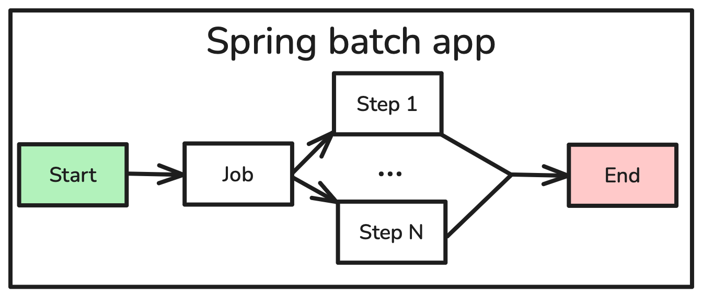
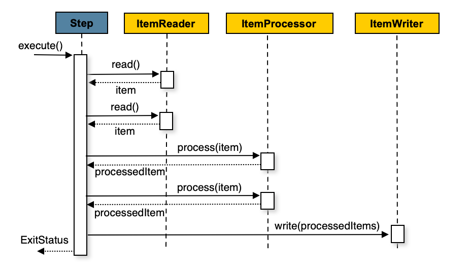
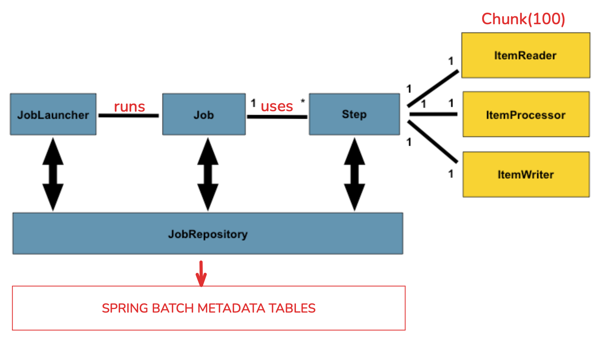
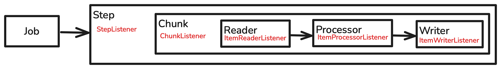

## ¿Qué es Spring Batch?

Es un framework dentro del ecosistema Spring diseñado para construir aplicaciones de procesamiento por lotes (*batch*) robustas, escalables y de alto rendimiento en Java.

Una aplicación Spring Batch consiste en la ejecución de un job programado que está compuesto por steps. Estos steps pueden ser *chunk-oriented* —con un reader, un processor y un writer— o un step *tasklet*, para implementar lógica que no encaja en la arquitectura chunk-oriented.

## Step chunk-oriented

La forma más común de aprovechar todos los beneficios de procesar grandes conjuntos de datos con Spring Batch es usar steps chunk-oriented. Se pueden construir con un reader y un writer, pero también es posible colocar un processor en medio.



### Reader

Se encarga de leer la información que se procesará en nuestro step. Spring Batch ofrece algunas clases por defecto para leer distintos formatos de datos como ficheros planos, JSON, XML, JDBC, JPA, Mongo y Kafka.

### Processor

Como muestra la imagen anterior, está pensado para aplicar cualquier transformación o lógica de negocio al item antes de escribirlo. Si, durante el procesamiento, se determina que el item no es válido, devolver `null` indica que el item no debe escribirse.

### Writer

El writer se encarga de tomar los items transformados y escribirlos en la salida deseada (base de datos, fichero plano, cola). Recibe los datos en chunks y los escribe en bloque, mejorando el rendimiento y reduciendo el uso de recursos.

### Chunk

Un grupo de items que se leen, procesan y escriben juntos como una única unidad dentro de un step. El procesamiento chunk-oriented mejora la eficiencia y la gestión de transacciones. Cuando un step chunk-oriented comienza, inicia una transacción y hace commit al final de cada chunk.

Es importante saber que existen componentes llamados *listeners* que pueden implementarse para añadir lógica antes o después de cualquier acción del proceso.

## Cómo funciona un job

Un job está compuesto por uno o más steps a ejecutar. Todas estas ejecuciones se guardan en las tablas de metadatos de Spring Batch a través del `JobRepository`. Cada step puede ser chunk-oriented o tasklet.



Si el step es chunk-oriented, inicia una transacción y hace commit después de cada chunk. Si un item lanza un error, el rollback afecta solo al chunk actual. En estos escenarios podemos definir lógica de *retry* y/o *skip* para excepciones concretas estableciendo las siguientes opciones:

```java
@Bean
public Step step1(JobRepository jobRepository, PlatformTransactionManager transactionManager) {
    return new StepBuilder("step1", jobRepository)
        .<String, String>chunk(10, transactionManager)
        .reader(flatFileItemReader())
        .writer(itemWriter())
        .faultTolerant()
        .skipLimit(10)
        .skip(FlatFileParseException.class)
        .retryLimit(3)
        .retry(DeadlockLoserDataAccessException.class)
        .build();
}
```

Ahora, cuando la aplicación lance un error de tipo `FlatFileParseException`, la ejecución no fallará hasta que ocurran 10 errores de ese tipo. Lo mismo aplica a la lógica de retry, pero solo para la excepción concreta definida para ella.

## Observabilidad en Spring Batch

En Spring Batch es posible implementar distintos tipos de listeners que se disparan antes y después de acciones concretas dentro del flujo de ejecución. Los listeners disponibles pueden engancharse a los siguientes niveles: Job, Step, Chunk, Skip, Reader, Processor y Writer.

Para los jobs, la interfaz para implementar el listener es `JobExecutionListener`, mientras que para el resto de componentes la interfaz principal es `StepListener`, y cada implementación concreta aporta sus propios métodos como `beforeChunk`, `afterChunk`, `beforeProcess`, `afterProcess`, entre otros.

Definiendo listeners en cada uno de estos puntos y diseñando estrategias adecuadas de monitorización y medición, podemos construir un sistema altamente observable con visibilidad detallada de cada etapa del procesamiento.

Cuando combinas esto con las estadísticas almacenadas en las tablas de metadatos de Spring Batch, obtienes una vista clara y detallada de todo lo que tu aplicación está haciendo entre bastidores.



El siguiente paso en el mundo de Spring Batch es profundizar en el procesamiento en paralelo: qué hay que tener en cuenta, estrategias comunes y algunos consejos para sacarle el máximo partido a tus jobs por lotes. Cubriré todo eso en el próximo artículo, ¡así que atento!
